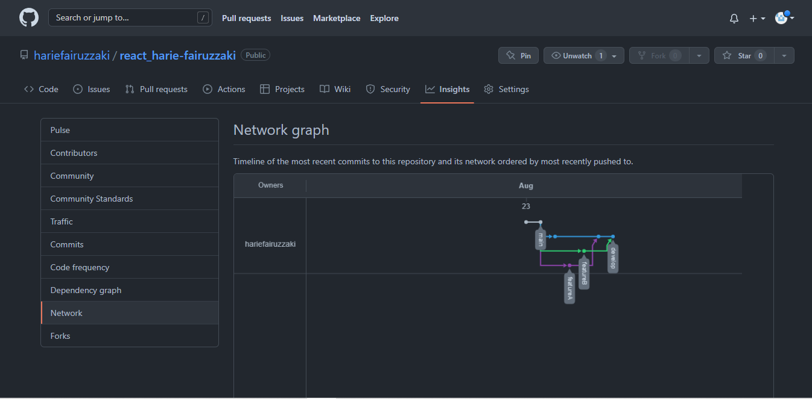

# 3 Version Control and Branch Managements (Git)

## Resume

Dalam materi ini, mempelajari:

1. Versioning
2. Git
3. The Staging Area

### Versioning

Adalah mengatur versi dari source code program, suatu proses untuk mengelola dan tracking suatu dokumen terkait adanya perubahan sehingga memudahkan untuk melihat versi terbaru dari dokumen tersebut.

Tools yang digunakan developer untuk melakukan versioning yaitu version control system (VCS). Version Control System (VCS) adalah sebuah sistem yang melakukan source code management (SCM) untuk mengelola perubahan di setiap dokumen, program komputer, website, dan kumpulan pemrograman lainnya.

### Git

Git merupakan software berbasis Version Control System (VCS) yang bertugas untuk mencatat perubahan seluruh file atau repository suatu project. Developer software biasa menggunakan Git untuk distributed revision (VCS terdistribusi), hal ini bertujuan untuk menyimpan database tidak hanya ke satu tempat. Namun semua orang yang terlibat dalam penyusunan kode dapat menyimpan database ini.

Prosedur yang diterapkan ini dapat membantu antar divisi project untuk memantau dan menghubungkan (merge) antar ekstensi yang berbeda dengan mudah. Sehingga aplikasi yang dibuat oleh sebuah tim project dapat berfungsi tanpa menghubungkan secara manual.

Terdapat istilah commit pada Git yang berfungsi untuk menyimpan riwayat perubahan data pada file. Melalui commit, developer dapat kembali ke source code sebelumnya dengan istilah checkout.

### The Staging Area

Terdapat 3 keadaan untuk menyimpan source code, yaitu working directory, staging area, dan .git directory (repository).

1. Working directory adalah checkout tunggal dari satu versi proyek. File-file ini ditarik dari database yang dikompresi di direktori Git dan ditempatkan pada disk untuk kamu gunakan atau modifikasi.
2. Staging Area adalah sebuah file, biasanya terdapat dalam direktori Git, yang menyimpan informasi tentang apa yang akan dimasukkan ke dalam commit kamu selanjutnya.
3. .git Direktori adalah tempat Git menyimpan metadata dan database objek untuk proyek kamu. Ini adalah bagian terpenting dari Git, dan inilah yang disalin saat kamu menduplikasi repositori dari remote server.

Alur kerja dari git adalah:

1. Memodifikasi proyek didalam working directory
2. Secara selektif menetapkan perubahan yang kamu inginkan menjadi bagian dari commit berikutnya, yang hanya menambahkan perubahan tersebut ke staging area.
3. Melakukan commit, yang mengambil file sebagaimana mereka berada di staging area dan menyimpan snapshot itu secara permanen ke .git direktori.

## Task

Pada task ini, membuat repository dan membuat 3 branch baru dalam repository tersebut dengan nama develop, featureA dan featureB. Kemudian melakukan merge dari branch featureA dan featureB ke branch develop.

Berikut output dari praktikum ini:

