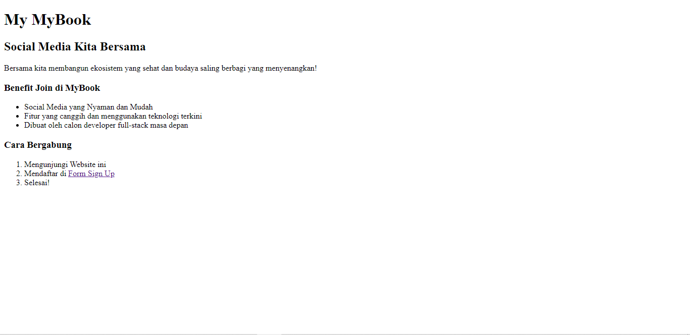
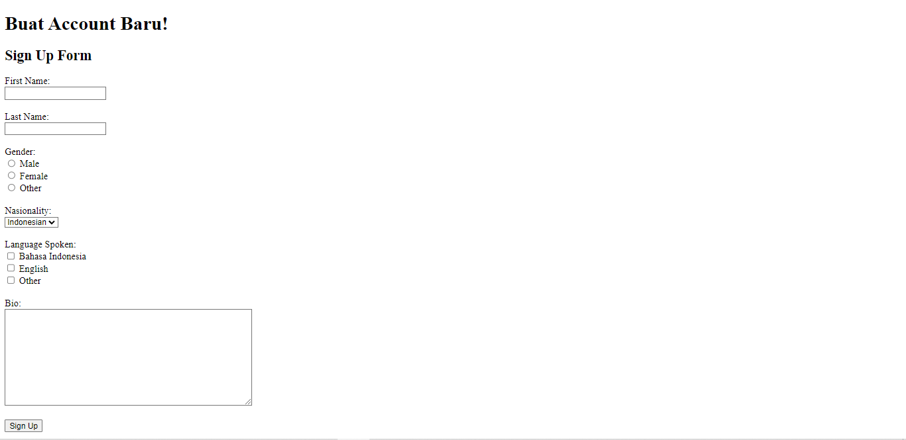
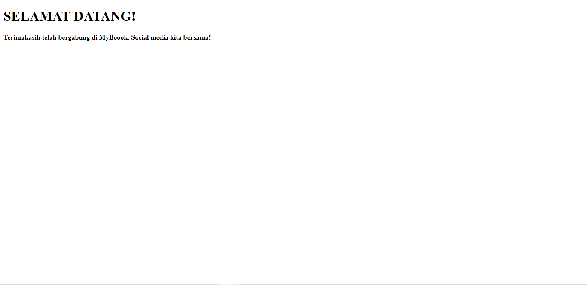

# 5 HTML

## Resume

### Front End

Frontend adalah sebuah bagian dari website yang membuat tampilan yang menarik kepada user.

### HTML

HTML (Hypertext Markup Language) adalah sebuah standar yang digunakan secara luas untuk menampilkan halaman web.

### Kegunaan HTML

- Membuat struktur dari halaman website.
- Mengatur tampilan dan isi dari halaman web.
- Membuat tabel dengan tag HTML table.
- Membuat form HTML.
- Membuat gambar dengan canvas.
- Mempublikasikan halaman website secara online.

## Task

praktikum:
[index.html](./praktikum/index.html)

output:

