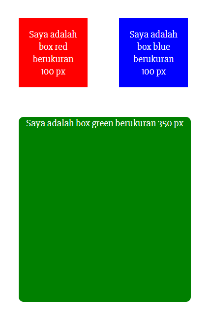
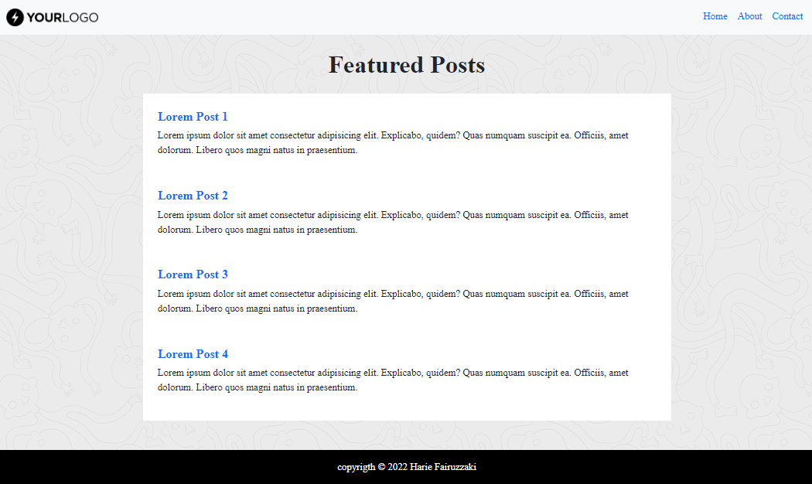

# 06 CSS (Cascading Style Sheet)

## Resume

### 1. CSS(Cascading Style Sheet)

CSS atau Cascading Style Sheet merupakan mekanisme yang mengatur gaya atau style pada halaman web agar memiliki visual yang menarik.

### 2. Menambahkan file CSS

Terdapat 3 cara untuk menambahkan file CSS ke dalam HTML:

1. External CSS

   `<link rel="stylesheet" href="style.css" />` syntax ini disisipkan ke dalam tag `<head>` pada HTML. Ekstensi file CSS adalah .css

2. Internal CSS

   Syntax css dapat digunakan di dalam satu file HTML. Didefisinikan di dalam elemen `<style>`, di dalam bagian `<head>` atau di dalam bagian `<body>`

3. Inline CSS

   Syntax css dapat digunakan utnuk elemen tunggal pada HTML. Diprioritaskan untuk menerapkan style yang unik.

### 3. CSS Selector

Pola yang digunakan untuk memilih elemen yang ingin di styling. Penanda HTML ke dalam CSS. Dapat menggunakan selector ID = (#) dan Class = ( . ).

## Task

Berikut kode hasil dari praktikum:

1. [file1.html](praktikum/file1.html)
2. [file2.html](praktikum/file2.html)

Output:

1. file1.html

   

2. file2.html

   
