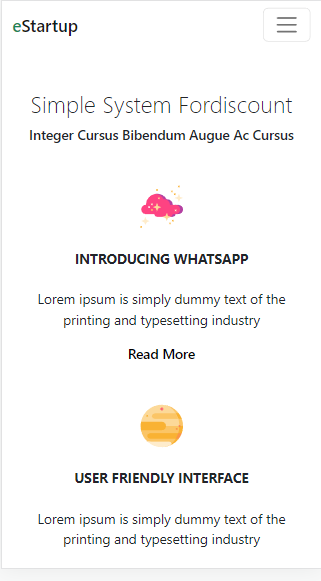
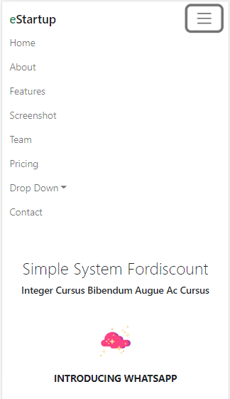
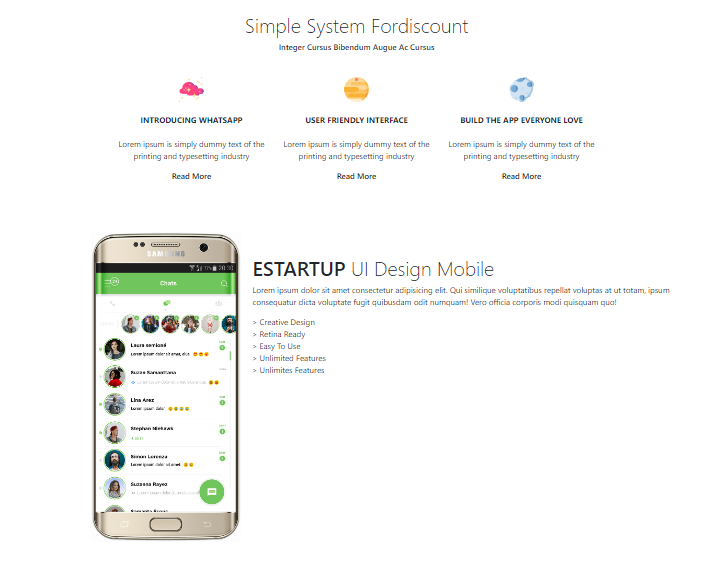
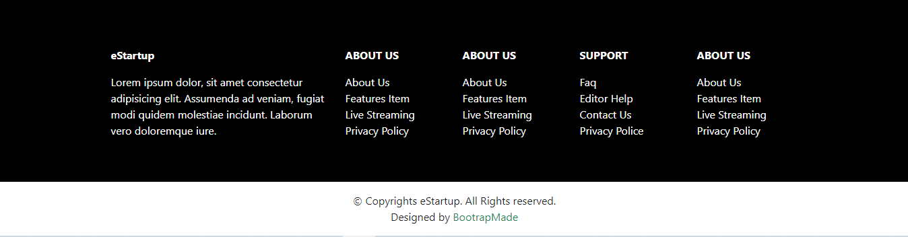
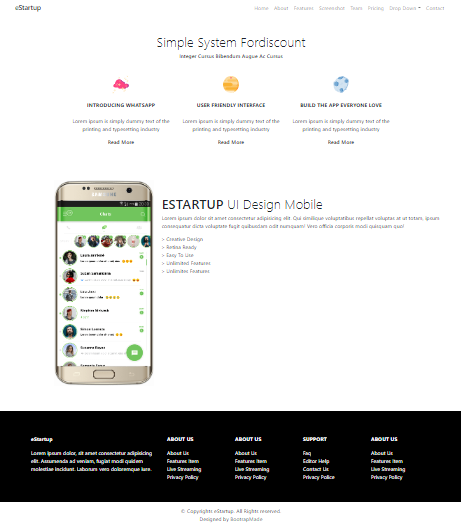

# Materi 7 - BOOTSTRAP

## Resume

---

### Frontend Framework

Adalah sekumpulan aturan kode yang bisa kita gunakan untuk mempermudah dalam membuat suatu tampilan website.

### Bootstrap

Bootstrap adalah framework web development gratis dan open-source yang dirancang untuk memudahkan proses pengembangan web responsif dan mobile-first (memprioritaskan perangkat seluler), dengan menyediakan berbagai syntax untuk desain template.

Dengan kata lain, Bootstrap adalah tool yang akan membantu web developer membangun website lebih cepat karena mereka tidak perlu repot dengan hal-hal dasar terkait command dan fungsi. Bootstrap terdiri dari skrip berbasis HTML, CSS, dan JS untuk berbagai komponen dalam desain web.

### Kelebihan Bootstrap

1. Gratis
2. Mudah dipelajari
3. Cepat
4. Mendukung Responsif

---

---

## Task

---

Pada task ini, diberikan 3 soal untuk membuat tampilan menggunakan bootstrap yang telah diberikan tampilannya di dalam soal:

1. Membuat header yang responsive.
2. Membuat body.
3. Membuat footer.

link soal: https://docs.google.com/document/d/1HlS8tK1b8HfobjdVQELTFv_GCKAkMOpjKXm9vYLSaw4/edit?usp=sharing

Berikut kode hasil dari praktikum:

- [index.html](./praktikum/index.html) == `berisikan kode untuk membuat tampilan header, body dan footer menggunakan bootstrap`

Output:

1. Header

   - Header

     

   - Header Responsive

     

   - Header Responsive Collapse

     

2. Body

   

3. Footer

   

4. Full

   
