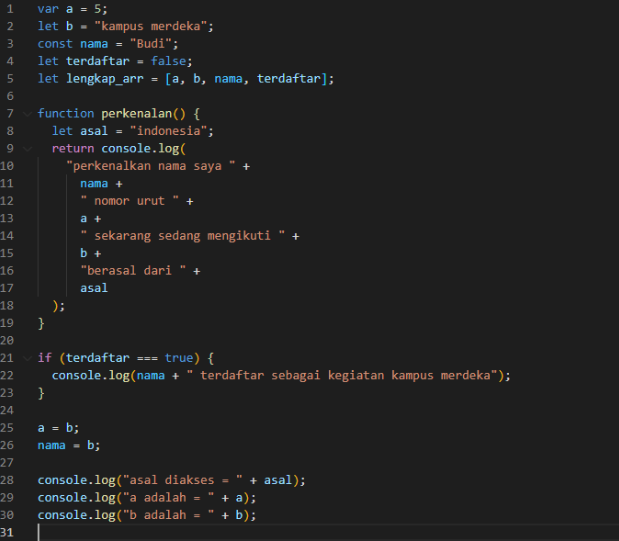
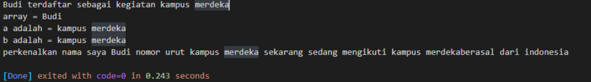
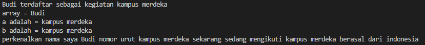
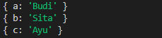
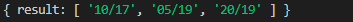
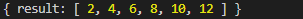
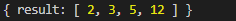

# Materi 8 - Javascript Refreshment

## Resume

3 poin yang dipelajari dari materi:

### Javascript

Adalah Bahasa Pemrograman yang High-Level, Scripting, Untyped dan interpreted.

High-level language adalah bahasa yang lebih mendekati bahasa manusia, terutama bahasa Inggris.

JavaScript adalah bahasa untyped karena dalam JavaScript variabel dapat menampung tipe data apa pun yang berarti JavaScript tidak memiliki deklarasi tipe data ketika variabel dibuat, kita tidak perlu menentukan tipe data apa pun tidak seperti bahasa pemrograman lain seperti Java, C#, C++, dll. yang membutuhkan int, char, float, dll. untuk membuat variabel.

Bahasa scripting adalah kode yang tidak perlu dikompilasi agar bisa dijalankan. Scripting language menggunakan interpreter untuk menerjemahkan kode atau perintah yang kita tulis supaya dimengerti oleh mesin.

Interpreter menerjemahkan source code menjadi machine codes. Interpreter akan menjalankan program secara langsung dari source code yang dibuat. Source code akan diterjemahkan baris per baris menjadi machine codes dan langsung dieksekusi pada saat itu juga. Tidak terdapat executable file yang dihasilkan selama proses interpretasi.

### Fungsi Javascript

Fungsi JavaScript di antaranya adalah untuk pengembangan aplikasi web dan mobile, membangun web server dan aplikasi server, membuat website yang interaktif, serta game development.

Saat ini, bahasa scripting ini memiliki banyak framework dan library yang bisa membantu mempercepat proses, seperti AngularJS, jQuery, and ReactJS. Meskipun umumnya melayani program berbasis web, fitur pemrograman JavaScript memiliki implementasi lain di area yang berbeda.

### Javascript sebagai Back-End Web Developer

Javascript juga berfungsi untuk pengembangan Back-End. Pengembangan back-end web dengan Javascript biasanya dibantu oleh sebuah platform bernama Node.js. Platform ini berguna untuk server-side programming. Server-side di sini artinya segala hal yang berhubungan dengan sang penyedia web, bukan dengan pengguna.

---

## Task

Pada task ini, diberikan 6 soal dengan link soal sebagai berikut:
https://docs.google.com/document/d/1Ke6H5HerrxYGt6QuDHtCCbqQwPUFcgGLoFI1a0n-6D8/edit?usp=sharing

1. Tulis ulang kode di bawah, dan simpan dengan format javascript.

   

   - Ambillah index ke-2 dalam array di baris 5 dan tampilkan dalam console.
   - Ubah kode diatas sehingga dapat menampilkan baris 22 di dalam console.
   - Lakukan pemanggilan untuk function perkenalan pada baris 31.
   - Kalian bebas mengubah kode di atas sehingga menampilkan output pada console seperti pada gambar di bawah.

     

     Jawaban kode: [soal1.js](./praktikum/soal1.js)

     output:

     

2. Jawab pertanyaan dibawah sesuai dengan materi yang telah dijelaskan.

   - Jelaskan kenapa baris 21, 22, 23 tidak dapat tampil?

     `Karena diluar scope function perkenalan() sehingga pengkodisian tidak berjalan.`

   - Jelaskan kenapa deklarasi pada baris 26 menyebabkan error?

     `Karena variable 'const' value-nya tidak dapat direassign atau tidak dapat diganti dengan value yang baru.`

   - Dengan melakukan komen pada baris ke-26, apakah baris 28 dapat di ekseskusi?

     `Tidak dapat diekseskusi, karena variable 'asal' bukanlah variable global melainkan variable di dalam function, sehingga tidak dapat diakses secara global karena terhalang scope, sehingga ketika dieksekusi muncul pesan 'asal is not defined'.`

3. Lakukan destructuring pada kode di bawah sehingga Budi tersimpan dalam varible bernama a, Sita tersimpan dalam variable bernama b, dan Ayu tersimpan dalam variable bernama c.

   `const foo = ["Budi", "Sita", "Ayu"];`

   Jawaban kode: [soal3.js](./praktikum/soal3.js)

   output:

   

4. Kalian memiliki sebuah variable berikut `(let bdays = ['10-17'. '05-19', '20-19'])`. Ubahlah tanda (-) dalam variable menjadi (/) sehingga output yang akan keluar dalam console menjadi `['10/17', '05/19', '20/19']`

   Jawaban kode: [soal4.js](./praktikum/soal4.js)

   output:

   

5. Kalian memiliki variable berikut `(let value = [1, 2, 3, 4, 5, 6])`. Kalikan setiap value dalam array tersebut dengan dua. Sehingga, ketika dipanggil variable value mengeluarkan output berupa `[2, 4, 6, 8, 10, 12]`.

   Jawaban kode: [soal5.js](./praktikum/soal5.js)

   output:

   

6. kalian memiliki variable berikut `(let arr = [1.5, 2.56, 5.1, 12.33])`. Bulatkan ke atas variable tersebut sehingga output yang dihasilkan adalah `[2, 3, 5, 12]`

   Jawaban kode: [soal6.js](./praktikum/soal6.js)

   output:

   
