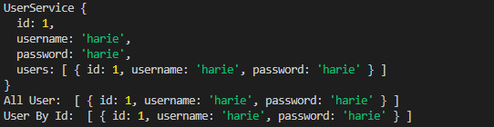
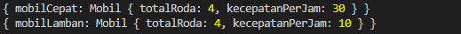

# Materi 9 - Clean Code

## Resume

### Clean Code

Clean code adalah istilah untuk kode yang mudah dibaca, difahami, dan diubah oleh programmer.

Tidak selalu code yang berjalan dengan baik itu adalah code yang bagus, code itu juga harus bisa mudah dibaca, mudah dipahami dan mudah dimodifikasi jika ada improvement ke depannya.

Kenapa Clean Code?

Karena kita akan selalu bekerja secara berkolaborasi. Karena itu, semua orang harus bisa membaca apa saja yang sudah kita dikerjakan.

### Karakteristik Clean Code

1. Mudah difahami
2. Mudah dieja dan dicari
3. Singkat namun mendeskripsikan konteks
4. Konsisten
5. Hindari penambahan konteks yang tidak perlu
6. Tidak banyak komentar
7. Good function
8. Gunakan konvensi
9. Formatting

### Clean Code Principle

1. KISS (Keep It So Simple)

   Hindari membuat fungsi yang dibuat untuk melakukan A, sekaligus memodifikasi B, mengecek fungsi C, dst.

   - Fungsi atau class harus kecil.
   - Fungsi dibuat untuk melakukan satu tugas saja.
   - Jangan gunakan terlalu banayk argumen pada fungsi.
   - Harus memperhatikan untuk mencapai kondisi yang seimbang.
   - kecil dan jumlahnya minimal.

2. DRY (Don't Repeat Yourself)

   Duplikasi code terjadi karena sering copy paste. Untuk menghindari duplikasi code buatlah fungsi yang dapat digunakan secara berulang-ulang.

3. Refactoring

   Refactoring adalah proses restrukturisasi kode yang dibuat, dengan cara mengubah struktur internal tanpa mengubah perilaku eksternal. Prinsip KISS dan DRY bisa dicapai dengan cara refactor.

   Teknik Refactoring

   - Membuat Sebuah abstraksi
   - Memecah kode dengan fungsi/class
   - Perbaiki penamaan dan lokasi kode.
   - Deteksi kode yang memiliki duplikasi.

---

## Task

Objective pada task ini adalah mampu menuliskan kode yang rapi dan terstruktur.

**Problem 1 - Analysis**

Kode berikut ini dituliskan tanpa mengikuti kebiasaan-kebiasaan penulisan yang disarankan.

```
class user {
var id;
var username;
var password;
}

class userservice {
    user[] users = []

    user[] getallusers() {
        return users
    }

    user getuserbyid(userid) {
        return this.users.filter(userid)
    }

}
```

1. Berapa banyak kekurangan dalam penulisan kode tersebut?

   `Terdapat 4 kekurangan`

2. Bagian mana saja terjadi kekurangan tersebut?

   - `class user { ... } dan class userservice { ... }`
   - ```
      {
         var id
         var username
         var password
      }
     ```
   - `user[] users = []`
   - `user[] getallusers { ... } dan user getuserbyid { ... }`

3. Tuliskan alasan dari tiap kekurangan tersebut!

   - Penulisan nama class, baiknya semua kata menggunakan huruf capital di huruf pertama, atau disebut naming conventions PascalCase. Seperti contoh `class User` dan `class UserService`.
   - Penulisan method, baiknya semua kata menggunakan huruf capital di huruf pertama, kecuali kata pertama, atau disebut naming conventions camelCase. Seperti contoh, `getAllUsers` dan `getUsersById`.
   - Membuat variable, dalam membuat variable di dalam Javascript Classes harus menggunakan `constructor` dan menggunakan keyword `this` sebelum nama variable, dan jika tidak menggunakan keyword `var` maka tidak perlu menggunakan `constructor`. Seperti contoh:

     ```
     class User {
         constructor(id, username, password) {
             this.id = id;
             this.username = username;
             this.password = password;
         }
     }

     ```

     atau

     ```
     class User {
         id;
         username;
         password;
     }
     ```

   - Jika ingin mengakses variable dari parent-object bisa menggunakan `extends`. Seperti contoh, `class UserServices extends User`. Juga, bisa menggunakan keyword `super()` untuk memanggil variable atau fungsi di parent-object. Seperti contoh `constructor(<nama_variable>) { super(<nama_variable>) }`.

Jawaban kode: [soal1.js](./praktikum/soal1.js)

Output:



**Problem 2 - Rewrite**

Kode berikut ini dituliskan tanpa mengikuti kebiasaan-kebiasaan penulisan yang disarankan. Ubahlah penulisan kode berikut menjadi lebih terbaca dan rapi!

```
class kendaraan {
    var totalroda = 0;
    var kecepatanperjam = 0;
}

class mobil extends kendaraan {
    void berjalan() {
        tambahKecepatan(10);
    }

    tambahkecepatan(var kecepatanbaru) {
        kecepatanperjam = kecepatanperjam + kecepatanbaru;
    }
}

void main () {
    mobilcepat = new mobil();
    mobilcepat.berjalan()
    mobilcepat.berjalan()
    mobilcepat.berjalan()

    mobillamban = new mobil();
    mobillamban.berjalan()
}
```

Jawaban kode: [soal2.js](./praktikum/soal2.js)

Output:


