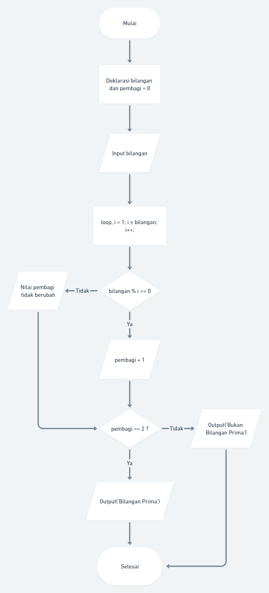
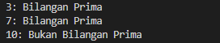

# Materi 10 - Introduction Algorithm

## Resume

### Algoritma

Algoritma adalah prosedur komputasi yang didefinisikan dengan baik yang mengambil beberapa nilai sebagai input dan menghasilkan beberapa nilai sebagai output.

Karakteristik Algoritma:

1. Memiliki batas (Awal dan akhir)
2. Instruksi terdefinisi dengan baik
3. Efektif dan efisien.

### Algoritma Dasar

1. Sequential adalah urutan dalam menyusun langkah-langkah untuk menyelesaikan suatu masalah.
2. Branching digunakan untuk menunjukan sebuah alur atau flow dari suatu program.
3. Looping adalah konsep untuk melakukan sebuah aksi secara berulang sampai kondisi tertentu terpenuhi.

### Cara penulisan algoritma

1. Pseudo Code adalah deskripsi bahasa sederhana yang bisa kita gunakan untuk menuangkan sebuah ide algoritma itu sendiri.
2. Flowchart adalah suatu bagan dengan simbol tertentu yang menggambarkan urutan dan hubungan antar proses secara mendetail.

---

## Task

Pada task ini, diminta untuk membuat fungsi untuk menentukan bahwa sebuah bilangan termasuk bilangan prima atau tidak.
Juga, membuat flowchart untuk menentukan bilangan prima.

**Problem 1 - Bilangan Prima (max : 50)**

Dalam matematika, bilangan prima adalah bilangan asli yang lebih besar dari angka 1, yang faktor pembaginya adalah 1 dan bilangan itu sendiri. 2 dan 3 adalah bilangan prima. 4 bukan bilangan prima karena 4 bisa dibagi 2. Kamu diminta untuk membuat fungsi untuk menentukan bahwa sebuah bilangan termasuk bilangan prima atau tidak.

**Buatlah flowchart untuk menentukan bilangan prima menggunakan**

https://whimsical.com!

**Sample Test Cases:**

- Input: 3, Output: Bilangan Prima
- Input: 7, Output: Bilangan Prima
- Input: 10, Output: Bukan Bilangan Prima

---

Berikut adalah Algoritma dan Flowchart untuk menentukan bilangan prima:

Bilangan Prima adalah bilangan yang hanya dapat dibagi oleh dua bilangan yang menghasilkan sisa bagi 0, dua bilangan tersebut yaitu bilangan 1 dan bilangan itu sendiri, tanpa bisa dibagi oleh bilangan lain.

1. Mendeklarasi bilangan dan pembagi = 0
2. Input bilangan
3. loop i = 1; i <= bilangan, i++
4. bilangan % i == 0
5. Jika ya, pembagi + 1
6. Jika tidak, nilai pembagi tidak berubah
7. pembagi == 2 ?
8. Jika ya, Output("Bilangan Prima")
9. Jika tidak, Output(“Bukan Bilangan Prima”)

Berikut hasil implementasi algoritma ke dalam kode: [index.js](./praktikum/index.js)

Output:

