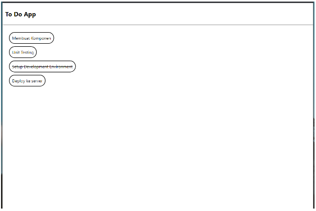
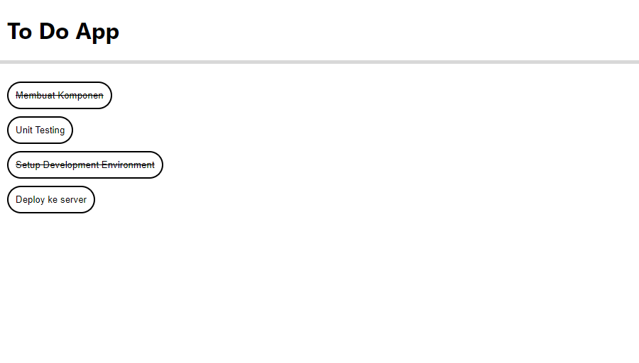

# Materi 12 - React Fundamental

## Resume

### JSX (Javascript XML)

JSX singkatan dari Javascript XML merupakan ekstensi pada javascript yang penggunaannya sangat disarankan pada react karena lebih menggambarkan apa yang seharusnya tampak pada user interface, jsx sendiri nantinya akan menghasilkan react element.

Kenapa menggunakan jsx?

- JSX dibuatkan berdasarkan fakta kalau logika rendering sangat terikat dengan logic UI.
- Separation of Technology (memisahkan teknologi, memisahkan mark up dan logika) -> Separation of Concerns (menggabungkan teknologi itu dan memisahkannya sesuai dengan kepentingannya)

### Komponen

Komponen React adalah bagian kode yang dapat digunakan kembali yang digunakan untuk menentukan tampilan, behaviour, dan state sebagian UI.

### Props

1. Singkatan dari properties, membuat kita dapat memberikan argumen / data pada component.
2. Props membantu untuk membuar komponen menjadi lebih dinamis.
3. Props dioper ke component sama seperti memberikan atribut pada tag HTML.
4. Props pada component adalah read-only dan tidak dapat diubah.

### Lifecycle (Siklus Hidup)

Lifecycle method yang umum

1. render()

   - Fungsi yang paling sering dipakai
   - Required pada class component
   - Pure function. Tidak boleh ada setState()

2. componentDidMount()

   - Dipanggil ketika component sudah di render untuk pertama kali
   - Tempat yang tepat untuk pemanggilan API
   - Boleh ada setState()

3. componentDidUpdate()

   - Dipanggil ketika terjadi update (props atau state berubah)

4. componentWillUnmount()
   - Dipanggil ketika component akan dihancurkan
   - Cocok untuk clean up actions

### Conditional

1. Render Bersyarat
   Pada React, kita dapat membuat komponen berbeda yang mencakup perilaku yang dibutuhkan. Lalu, kita dapat me-render hanya seberapa bagian saja, berdasarkan state dari aplikasi anda.

   - Menggunakan If
   - Inline If dengan operator &&
   - Inline If-ELse dengan ternary conditional operator
   - Mencegah komponen untuk rendering

### Directory Structure

React tidak memiliki pendapat tentang bagaimana cara memasukkan file ke folder. Berikut saran dalam menentukan directory structure:

1. Pengelompokan berdasarkan fitur atau rute
2. Pengelompokan berdasarkan jenis file
3. Hindari terlalu banyak nesting
4. Jangan terlalu memikirkannya

---

## Task

Pada task ini, buatlah sebuah aplikasi daftar tugas (todo list). Daftar barang itu memiliki 3 field yakni id (number), name (string), dan completed (boolean). Apabila completed adalah “True” maka nama todo-nya akan tercoret. Berikut ini tampilan aplikasi setelah dibuat. Poin terpenting adalah teman - teman mampu melakukan komposisi komponen, implementasi list rendering & styling.



Contoh data:

```
[
  {
    id: 1,
    title: "Membuat Komponen",
    completed: true,
  },
  {
    id: 2,
    title: "Unit Testing",
    completed: false,
  },
  {
    id: 3,
    title: "Setup Development Environment",
    completed: true,
  },
  {
    id: 4,
    title: "Deploy ke server",
    completed: false,
  },
]
```

Jawaban kode: [TodoPage.js](./praktikum/src/App.js)

Output:


