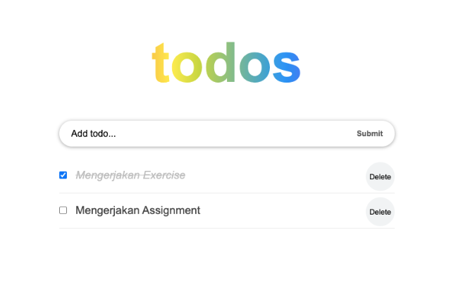

# Materi 13 - Event Handling

## Resume

### State Learning

State adalah data private sebuah component. Data ini hanya tersedia untuk component tersebut dan tidak bisa diakses dari component lain.

1. Data yang bisa dimodifikasi menggunakan setState
2. Setiap terjadi modifikasi akan terjadi render ulang
3. Bersifat Asycnhronous
4. Dipakai dalam class

### Statefull and Stateless

1. Statefull component adalah memiliki state. Component ini dibuat dengan class. Kelebihan dari class component adalah memiliki lifecycle.

2. Stateless component adalah tidak memiliki state hanya prop. Umumnya component ini dibut dengan function karena codenya lebih ringkas.

**Komponen statefull dan stateless memiliki banyak nama berbeda**

Mereka juga dikenal sebagai:

1. Smart component & Dump component
2. Container component & Presentational component

**Perbedaan dari komponen statefull dan komponen stateless**

1.  Stateless Component
    - Tidak tahu tentang aplikasi
    - Tidak melakukan data fetching (pengambilan data)
    - Tujuan utamanya adalah visualisasi
    - Dapat digunakan kembali
    - hanya berkomunikasi dengan induk langsungnya
2.  Stateful Component
    - Mengerti tentang aplikasi
    - Melakukan data fetching (pengambilan data)
    - Berinteraksi dengan aplikasi
    - Tidak dapat digunakan kembali
    - Menentukan status dan data ke anak-anaknya

### Handling Events

Handling Event adalah suatu metode untuk menangani sebuag event / aksi yang diberikan pengguna kepada suatu komponen.

Event adalah suatu peristiwa yang dipicu oleh pengguna pada suatu komponen, misalnya tombol ditekan.

Beberapa contoh list event

1. Clipbaord Events (promise terpenuhi)
2. Form Events (onChange, onSubmit)
3. Mouse Events (onClick, onDoubleClick, onMouseOver)
4. Generic Events (onError, onLoad)

---

## Task

Pada task ini, buatlah daftar pekerjaan yang akan kamu kerjakan, dengan kriteria sebagai berikut:

1. Daftar pekerjaan dapat ditambahkan menggunakan inputan
2. Terdapat checklist pada setiap daftar pekerjaan
3. Aktifkan checklist jika pekerjaan selesai dikerjakan, seperti contoh dibawah
4. Sertakan tombol hapus untuk menghapus suatu pekerjaan dari daftar pekerjaan
5. Apabila inputan yang anda submit tersebut kosong, tampilkan alert bahwa anda harus mengisi inputam tersebut terlebih dahulu sebelum anda submit

Berikut merupakan contohnya

Data:

```
[
    {
        id: 1,
        title: "Mengerjakan Exercise",
        completed: true
    },
    {
        id: 2,
        title: "Mengerjakan Assignment",
        completed: false
    }
]
```

Tampilan:



Berikut jawaban kode: [ToDoApp](./praktikum/src/pages/ToDoApp.js)

Output tampilan Kode:


