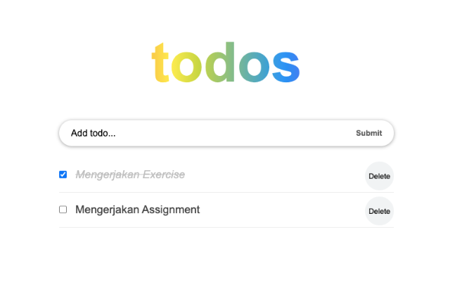
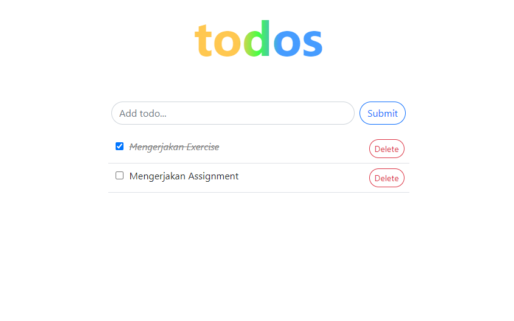

# Materi 14 - React Hook

## Resume

### Introduction React

React Hook merupakan fitur baru di React 16.8. Dengan Hooks, kita dapat menggunakan state dan fitur React yang lain tanpa perlu menulis sebuah kelas.

**Motivasi**

- Kesulitan untuk menggunakan kembali stateful logic antar komponen
- Komponen kompleks menjadi sulit untuk dimengerti
- Kelas membingungkan manusia dan mesin

**Hooks pada React**

Hooks Dasar

- useState
- useEffect
- useContext

Hooks Tambahan

- useReducer
- useCallback
- useMemo
- useRef
- useImperativeHandle
- useLayoutEffect
- useDebugValue

**Aturan Hook**

1. Hanya Panggil Hooks di Tingkat Atas

   Jangan memanggil Hooks dari dalam loops, condition, atau nested function

2. Hanya Panggil Hooks dari Fungsi-Fungsi React

   Jangan memanggil Hooks dari fungisi-fungsi Javascript biasa.
   Kita dapat:

   - Memanggil Hooks dari komponen-komponen fungsi React
   - Memanggil Hooks dari custom Hooks

### useState dan useEffect

**useState**

useState di panggil dalam function component untuk menambahkan suatu state lokal. React akan menyimpan state antar render. useState memberikan dua hal: nilai state saat ini dan fungsi untuk memperbarui nilai tersebut.

**useEffect**

- Effect Hook memungkinkan kita melakukan efek samping (side effect) di dalam function component
- componentDidMount, componentDidUpdate, dan componentWillUnmount = useEffect
- Ada dua jenis: Butuh pembersihan dan tidak butuh pembersihan

### Custom Hooks

Membuat Hook kita sendiri memungkinkan kita mengekstrak komponen logika ke fungsi yang dapat digunakan lagi

## Task

Ubah Class Component pada assignment sebelumnya (praktikum 13 - Event Handling) menjadi Function Component. Sekaligus ubah lifecycle method & state management menggunakan React Hooks.

Berikut merupakan contohnya

Data:

```
[
    {
        id: 1,
        title: "Mengerjakan Exercise",
        completed: true
    },
    {
        id: 2,
        title: "Mengerjakan Assignment",
        completed: false
    }
]
```

Tampilan:



Berikut jawaban kode: [ToDoApp](./praktikum/src/pages/ToDoApp.js)

Output tampilan Kode:


