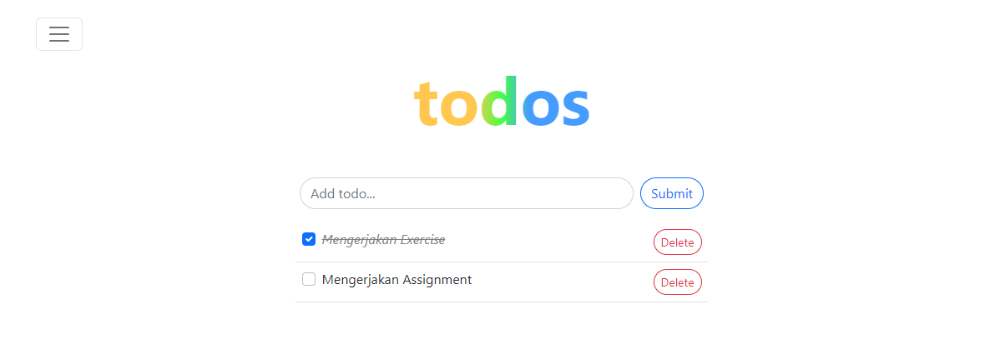

# Materi 15 - React Routing

## Resume

### Routes Learning

Router merupakan modul dalam React yang berfungsi untuk melakukan proses navigasi pada SPA (Single Page Application).

**Multi Page Application (MPA)**

Multi Page Application (MPA) juga disebut dengan tradisional web app adalah jenis aplikasi website dimana perlu memuat ulang seluruh halaman web setiap kali membuat permintaan baru.

**Single Page Application (SPA)**

Single Page Application (SPA) adalah salah satu jenis aplikasi website dimana hanya ada 1 halaman yang menangani semua aktifitas yang terjadi dalam aplikasi tersebut.

**Keunggulan SPA dan MPA**

| Single Page Application                            | Multi Page Application                                                                               |
| -------------------------------------------------- | ---------------------------------------------------------------------------------------------------- |
| Waktu loading website jauh lebih cepat             | SEO website lebih mudah dioptimasi                                                                   |
| Tidak ada query tambahan ke server                 | Memudahkan untuk mengubah halaman tertentu untuk setiap kebutuhan yang berbeda                       |
| Front-End yang cepat dan responsif                 | Menggunakan tools analisis seperti Google Analityics yang dapat terintegrasi langsung dengan website |
| Meningkatkan pengalaman pengguna (user experience) |                                                                                                      |

**Kekurangan SPA dan MPA**

| Single Page Application                    | Multi Page Application                                                  |
| ------------------------------------------ | ----------------------------------------------------------------------- |
| Tidak bagus dalam SEO                      | Kecepatan download website jauh lebih lama jika dibandingkan dengan SPA |
| Berat saat di load/buka pertama kali       | Kamu perlu mengintegrasikan antara front-end dan back-end               |
| Kurang aman dibanding dengan website biasa | Lebih sering membutuhkan maintenance dan update                         |
| Masalah kompatibilitas browser             | Mungkin akan lebih sering menemukan masalah performa pada website       |

**React Router**

`BrowserRouter` digunakan sebagai router yang menggunakan `API history` dari HTML5, sehingga dapat menggunakan lcoation untuk sinkronkan UI dengan url. Di dalam object `location` sendiri merepresentasikan dimana lokasi aplikasi sekarang.

`Route` digunakan sebagai `pengarah` jalan nya `lalu lintas` suatu aplikasi.
Attribute `path` merupakan `url` pada `browser` pada proses routing.
Attribute `component` merupakan suatu komponen yang akan `ditampilkan` kepada user saat `mengakses` `path` yang didefinisikan.

`Switch` digunakan untuk membungkus kumpulan beberapa component `Route`.
`Exact` bertugas untuk `memastikan` route hanya me-render component yang memiliki `path` yang `cocok`. Jika tidak ada yang cocok, maka route yang akan di-render yaitu route terakhir dengan component `Notfound`.

`Link` digunakan untuk `berpindah` antar halaman, property `to` tersebut merujuk pada path di route yang akan dituju.

### URL Parameter

Parameter URL adalah suatu parameter yang nilainya ditetapkan secara dinamis di URL halaman. Contoh: `path="/movie/:id"`

**Perbedaan Link dan Redirect**

| Link                                 | Redirect                                |
| ------------------------------------ | --------------------------------------- |
| Dapat digunakan pada kondisi apapun  | Lebih sering digunakan pada halaman 404 |
| Memberikan history baru pada browser | Menimpa history pada browser            |
| Beraksi dengan click seperti a href  | Beraksi dengan suatu kondisi            |

### Hook Routing React

`useHistory` memberi kita akses ke `instance riwayat` yang dapat anda gunakan untuk bernavigasi.

Contoh:

1. length
2. go
3. goBack
4. goForward
5. Push

dan seterusnya..

| Property  | Kegunaan                                                           |
| --------- | ------------------------------------------------------------------ |
| length    | (angka) Jumlah entri dalam tumpukan riwayat                        |
| go        | (fungsi) Memindahkan penunjuk di tumpukan riwayat sebanyak n entri |
| goBack    | (fungsi) Setara dengan go(-1)                                      |
| goForward | (fungsi) Setara dengan go(1)                                       |
| Push      | (fungsi) Mendorong entri baru ke tumpukan riwayat                  |
| replace   | (fungsi) Mengganti entri saat ini di tumpukan riawat history       |

`useParams` mengembalikan objek pasangan `kunci/nilai parameter` URL. Gunakan untuk mengakses `match.params` dari `<Route>` saat ini.

`useRouteMatch` mencoba `mencocokkan URL` saat ini dengan cara yang sama seperti `<Route>`. Ini sebagian besar berguna untuk mendapatkan akses ke data kecocokan tanpa benar-benar merender `<Route>`.

---

## Task

Lanjutkan daftar yang telah kamu kerjakan saat assignment React Hooks sebelumnya, kerjakan dengan kriteria sebagai berikut:

1. Buatlah navbar dengan menggunakan link, home dengan path: "/", dan buat about dengan path: "/about" seperti contoh gambar di bawah.
2. Untuk page about terdapat navbar baru yaitu About App dengan path: "/about/about-app", dan About Author dengan path: "/about/about-author"
3. Jika path yang diinputkan tidak ada dalam route yang kita buat, buatlah page not match/not found pada path tersebut.
4. Jika link mengarah ke halaman yang sama berikan replace atau redirect agar tidak menambah history baru pada browser (optional, nilai tambah).
5. Icon atau tampilan navbar bebas namun konsep tetap sama.

(\*) Kerapihan dan inovasi menjadi suatu nilai tambah.

Berikut merupakan contohnya.

Tampilan:

About App =>

About Author =>

Page Not Found =>

---

Jawaban kode:

Di dalam component/ terdapat component SideBar.js

[component](./praktikum/src/components/)

Di dalam pages/ terdapat page about, home, dan notFound

[pages](./praktikum/src/pages/)

Routes terdapat di App.js

[App.js](./praktikum/src/App.js)

Output Tampilan:

Home

About

About the App, path: "/about/about-app"

About the Author, path: "/about/about-author"

Page Not Found

