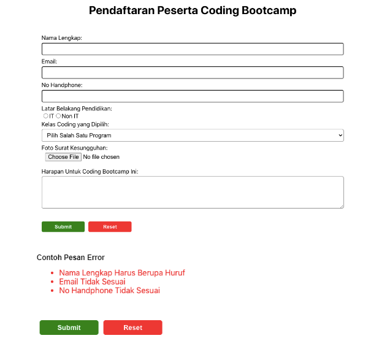
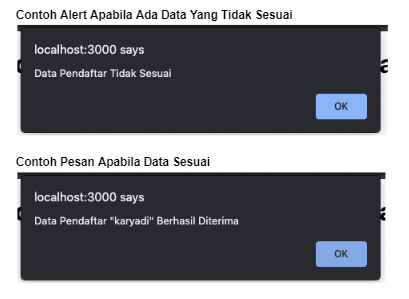
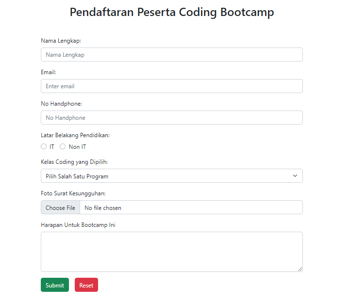
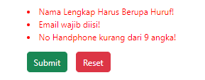
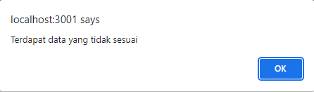
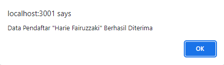

# Materi 16 - React Form

## Resume

### Basic Form

**Penerapan Form**

Form merupakan salah satu hal krusial dalam pengembangan aplikasi website. Form dapat digunakan untuk menghandle inputan dari user.

Form banyak kita jumpai saat login, mendaftarkan sesuatu, memberikan feedback, mengisi data dan masih banyak lainnya.

Dalam react ada banyak hal kita pelajari dari Form. Seperti bagaimana menghandle inputan? Bagaimana memvalidasi inputan dsb.

**Macam Form**

1. Elemen `<input>`

   Elemen `<input>` biasanya digunakan inputan yang tidak terlalu panjang.

2. Elemen `<textarea>`

   Elemen `<textarea>` biasanya digunakan inputan yang cukup panjang. Semisal deskripsi.

3. Elemen `<select>`

   Elemen `<select>` biasanya digunakan untuk inputan yang pilihannya sudah ditentukan.

4. Radio Button

   Radio button merupakan salah satu type di elemen `<input>`. Kita hanya bisa memilih 1 pilihan menggunakan radio button.

5. Checkbox

   Checkbox merupakan salah satu type di elemen `<input>`. Kita bisa memilih lebih dari 1 pilhan menggunakan checkbox.

**Type elemen input lainnya**

Selain yang sudah disebutkan, masih banyak lagi type elemen input lainnya.

|                | type     |        |
| -------------- | -------- | ------ |
| text (default) | image    | submit |
| button         | month    | tel    |
| color          | number   | time   |
| checkbox       | password | url    |
| date           | radio    | week   |
| datetime-local | range    |        |
| email          | reset    |        |
| file           | search   |        |
| hidden         |          |        |

### Controlled Component dan Uncontrolled Component

**Controlled Component**

Kita dapat menggabungkan cara menyimpan dan memperbarui state di HTML dan React dengan menggunakan state pada React. Kemudian komponen React yang me-render sebuah form juga mengontrol apa yang terjadi dalam form tersebut pada masukan pengguna selanjutnya.

Sebuah elemen masukan form yang nilainya dikontrol oleh React melalui cara seperti ini disebut sebagai "controlled component".

1. Textarea pada HTML

   Pada HTML, elemen `<textare>` mendefinisikan teks di dalamnya sebagai elemen anaknya:

   ```
   <textarea>
      Hello there, this is some text in a text area
   </textarea>
   ```

   Di React, `<textarea>` menggunakan atribut value. Dengan cara ini, sebuah form yang menggunakan `<textarea>` dapat ditulis dengan cara yang sangat mirip dengan sebuah form yang menggunakan input satu baris.

2. Tag Select, pada HTML vs React

   Pada HTML, `<select>` membuat sebuah daftar drop-down.

   ```
   <select>
      <option value="grapefruit">Grapefruit</option>
      <option value="lime">lime</option>
      <option selected value="coconut">Coconut</option>
      <option value="mango">Mango</option>
   </select>
   ```

   Perhatikan bahwa opsi Coconut mula-mula dipilih, karena adanya atribut selected. Di React, alih-alih menggunakan atribut selected, kita menggunakan atribut value di tag select. Hal ini lebih mudah karena hanya perlu diubah di satu tempat saja.

   Catatan
   Kita bisa memasukkan array atribut value, yang memungkinkan kita memilih beberapa opsi dalam tag select:

   ```
   <select multiple={true} value={['B', 'C']}>
   ```

3. Handle Banyak Input

   - Atribute name
     ketika kita membutuhkan penangan banyak elemen pada controlled component, kita dapat menambahkan atribut name pada setiap elemen dan membiarkan fungsi handler memilih apa yang harus dilakukan berdasarkan nilai dari event.target.name.

   - Handle Inputnya

     ```
     const handleInputChange = (e) => {
         const target = e.target;
         const value = target.type === "checkbox" ? target.checked : target.value;
         const name = target.name;

         setInputs({
         ...inputs,
         [name]: value,
         });
     };
     ```

**Uncontrolled Component**

Uncontrolled component adalah `alternatif lain dari controlled component`, dimana `data form akan ditangani oleh DOM-nya` sendiri. Untuk menulis uncontrolled component, alih-alih menulis event handler untuk setiap pembaruan state, kita bisa menggunakan ref untuk mendapatkan nilai form dari DOM.

Karena hal ini, terkadang lebih mudah untuk mengintegrasikan kode React dan non-React jika menggunakan uncontrolled component. Ini berarti lebih sedikit kode jika kita menginginkan solusi cepat walau tak rapi. Selain itu pada umumnya kita harus menggunakan controlled component.

1.  Nilai Default

    Atribut defaultValue

    Pada lifecycle rendering React, atribut value pada elemen form akan menimpa nilai pada DOM. Dengan uncontrolled component, sering kali kita ingin React dapat menentukan nilai awal tetapi pembaruan berikutnya dilakukan secara uncontrolled. Untuk menangani kasus ini, kita bisa menggunakan atribut default Value alih-alih menggunakan value.

    Kita bisa menggunakan defaultChecked untuk `<input type="checkbox">` dan `<input type="radio">`, serta `defaultValue` untuk `<select>` dan `<textarea>`.

2.  Tag File Input

    Pada HTML, sebuah `<input type="file" />` memungkinkan pengguna untuk memilih satu atau beberapa file dari media penyimpanan mereka untuk diunggah ke server atau dimanipulasi dengan JavaScript lewat File API.

    Dalam React, sebuah `<input type="file" />` merupakan uncontrolled component karena nilainya hanya bisa disetel oleh pengguna, bukan oleh kode program.

**Uncontrolled vs Controlled Component**

**Uncontrolled Component?**

Input yang tidak terkontrol seperti input formulir HTML tradisional.

Kita kemudian bisa mendapatkan nilainya menggunakan ref. Misalnya, di tombol ditambahkan onCLickHandler.

Dengan kata lain, kita harus 'menarik' nilai dari field saat kita membutuhkannya. Ini bisa terjadi ketika formulir di submit.

Itu adalah cara paling sederhana untuk mengimplementasikan input formulir. Tentu saja ada kasus yang valid untuk menggunakannya: dalam form sederhana dan saat belajar React.

Namun, uncontrolled input tidak powerful. Jadi selanjutnya kita akan mempelajari controlled input.

**Controlled Component?**

Sebuah controlled input menerima nilai saat ini sebagai prop, serta callback untuk mengubah nilai tersebut. Kita bisa mengatakan ini adalah cara yang lebih "React way" untuk pendekatan ini (yang tidak berarti harus selalu menggunakannya).

    `<input value={someValue} onChange={handleChange} />`

Tetapi nilai input ini harus ada di state yang disimpan di suatu tempat. Biasanya, komponen yang merender input (alias form component menyimpannya di state-nya. Tentu saja, itu bisa dalam state komponen lain, atau bahkan di penyimpanan state terpisah (separate state store), seperti Redux.

**Flow Controlled Component**

Setiap kali kita mengetik karakter baru, handleChange dipanggil. Dibutuhkan nilai baru dari input dan mengaturnya di state.

Ini juga berarti bahwa komponen form dapat merespon perubahan input dengan segera, misalnya oleh

- umpan balik di tempat, seperti validasi
- menonaktifkan tombol kecuali semua field memiliki data yang valid
- mengimplementasi format input tertentu, seperti nomor kartu kredit

Tetapi jika tidak memerlukan semua itu dan menganggap uncontrolled lebih sederhana, lakukanlah.

**Apa yang Membuat Elemen 'Controlled'?**

**Menjadi 'Controlled'**

Selain input, ada elemen bentuk lain, seperti checkboxes, radios, selects and textareas. Elemen formulir menjadi "controlled" jika kita menetapkan nilainya melalui prop.

Namun, masing-masing elemen formulir memiliki prop yang berbeda untuk menetapkan nilai itu.

| Element                     | Value property       | Change Callback | New value in callback |
| --------------------------- | -------------------- | --------------- | --------------------- |
| `<input type="text" />`     | value="string"       | onChange        | event.target.value    |
| `<input type="checkbox" />` | checked=(boolean)    | onChange        | event.target.checked  |
| `<input type="radio" /> `   | checked=(boolean)    | onChange        | event.target.checked  |
| `<textarea /> `             | value="string"       | onChange        | event.target.value    |
| `<select /> `               | value="option value" | onChange        | event.target.value    |

### Basic Validation

**Kenapa Perlu Validasi**

Pada dasarnya, ada 3 alasan mengapa validasi form diperlukan:

- Mencari input data yang benar dan sesuai format. Sebuah web/aplikasi tidak dapat berjalan dengan benar, jika data yang diolah tidak sesuai dengan kebutuhan aplikasi
- Melindungi akun pengguna. Misalnya, membuat pengguna untuk memasukkan data password yang aman
- Melindungi sistem/aplikasi. Validasi form yang kuat dapat meminimalisir perilaku pengguna yang ingin meretas sistem/aplikasi

**Tipe Validasi Data Formulir**

**Client-side validation**

Validasi yang dilakukan pada sisi klien (browser). Validasi ini dilakukan agar data input sesuai dengan kebutuhan form, sebelum data form dikirimkan ke server.

Kelebihan validasi sisi klien ialah user-friendly, arena jika terjadi kesalahan pengguna akan langsung diberitahu. Pengguna tidak harus menunggu respon dari server untuk mengetahui hasil validasi.

Validasi sisi klien, terbagi atas dua bagian

- Built-in form validation, yaitu menggunakan fitur validasi langsung dari HTML5. Biasanya, validasi ini tidak membutuhkan Javascript dan memiliki performa yang lebih baik. Tapi tidak dapat dikostumisasi. Kadang pesan errornya cukup kaku'.
  Contohnya : required, minlength, maxlength, min, max, type
  dan pattern.
- Menggunakan Javascript. Ini membuat validasi form dapat dikostumisasi. Tetapi kita perlu membuatnya sendiri.

**Server-side validation**

Validasi yang dilakukan pada sisi server. Sisi server bertugas untuk memvalidasi data kembali, sebelum disimpan di database. Jika ditemukan kesalahan, maka response akan dikirim kembali ke client berupa koreksi atas kesalahan yang dibuat oleh pengguna.

Berbeda dengan validasi sisi klien, validasi in tidak user-friendly. Karena, koreksi kesalahan akan dikirimkan, setelah form di-submit.

**Built-in form validation**

- required

  required digunakan untuk menentukan field form perlu disi sebelum formulir dapat dikirimkan

- minlength dan maxlength

  minlength dan maxlength digunakan untuk menentukan jumlah karakter minimal dan maksimal yang bisa dimasukkan. Jika kurang
  dari minlength akan muncul pemberitahuan, dan tidak bisa melebihi maxlength.

- min dan max

  min dan max digunakan untuk menentukan nilai minimum dan maksimum angka yang bisa dimasukkan.

- type

  type digunakan untuk menentukan apakah data berupa angka, email, atau type yang lainnya.

- pattern

  pattern digunakan untuk menentukan regular expression (regex) yang mendefinisikan pola data yang boleh dimasukkan.

**Javascript bisa kapan saja melakukan validasi?**

- Ketika ada perubahan di form. Ketika ada perubahan, akan mentrigger event onChange. Cukup real-time berdasarkan perubahan data, namun fungsi kelebihannya validasi akan terus dipanggil selama ada perubahan. Bisa dikombinasikan dengan disable button.
- Ketika menekan tombol submit, akan mentrigger event onSubmit. Kelebihannya validasi cukup sekali, namun tidak akan real-time memvalidasi form.

---

## Task

Assignment ReactS Topic Form

Buatlah formulir yang berjudul "Pendaftaran Peserta Coding Bootcamp". Form pendaftaran tersebut memiliki ketentuan sebagai berikut ini:

- Field "Nama" lengkap wajib, hanya menerima huruf
- Field "Email" wajib
- Field "No Handphone" wajib, panjangnya 9-14 karakter, berupa angka
- Field "Latar Belakang Pendidikan", Wajib, berupa radio button pilihannya IT dan Non IT
- Field "Kelas Koding yang Dipilih, wajib. Pilihannya ada tiga yakni

  1. Coding Backend with Golang
  2. Coding Frontend with ReactJS
  3. Fullstack Developer

- Field "Foto Surat Kesungguhan" bersifat wajib
- Field "Harapan Untuk Coding Bootcamp Ini" bersifat opsional.
- Tombol "Submit" untuk mensubmit data dan mereset form. Bersifat wajib
- Tombol "Reset"' untuk mereset form dan mereset pesan error. Bersifat tidak wajib.

Apabila ada error, bisa ditampilkan antara form dan tombol submit. Ketika tombol submit ditekan, akan muncul alert baik ketika ada error maupun saat data benar. Utamakan fungsionalitasnya. Kerapihan dan inovasi menjadi suatu nilai tambah.

**Contoh Data**

Berikut merupakan contoh data yang bisa teman teman gunakan. Tapi ini sekedar contoh saja, untuk dijadikan referensi, Kalian bisa mengubahnya, menyesuaikan kebutuhan dan selera masing masing.

```
  const baseData = {
    nama: "",
    email: "",
    noHandphone: "",
    pendidikan: "",
    kelas: "",
    harapan: "",
  };

  const baseError = {
    nama: "",
    email: "",
    noHandphone: "",
  };

  const suratKesungguhan = useRef("");
  const [data, setData] = useState(baseData);
  const [errorMessage, setErrorMessage] = useState(baseError);
```

**Tampilan**





---

Jawaban Kode: [FormDaftar.js](./praktikum/src/pages/FormDaftar.js)

Tampilan Output:








