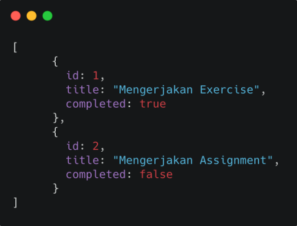
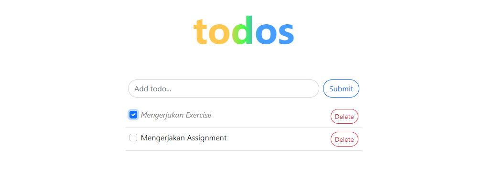

# Materi 17 - Fetching Data

## Resume

### What is Hasura?

The Hasura GraphQL Engine is a blazing-fast GraphQL server that gives you instant, realtime GraphQL APIs over Postgres, with webhook triggers on database events, and remote schemas for business logic.

### What is Postman?

Postman is an API platform for developers to design, build, test and iterate their APIs.

### Why use POSTMAN

1. Easy for collaborate with auto sync with other member
2. Simple interface
3. POSTMAN is free upto 3 member and unlimited collection

---

## Task

2. Soal untuk nilai data fetching

Gunakan lah hasura untuk membuat database dan juga Restfull API sehingga memiliki struktur
data seperti di bawah:

Output praktikum:

