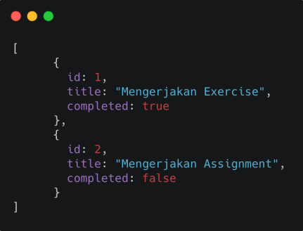
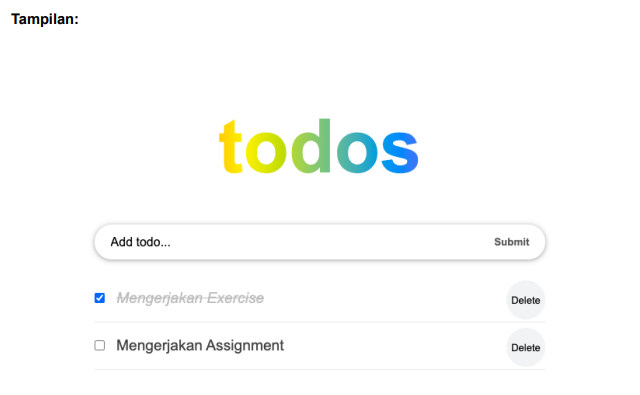
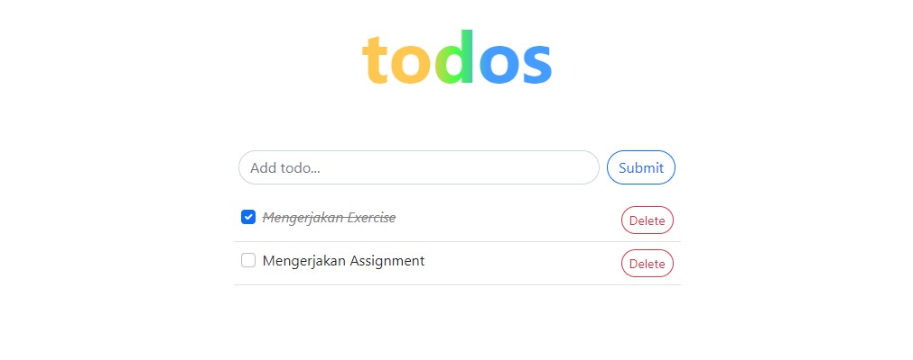
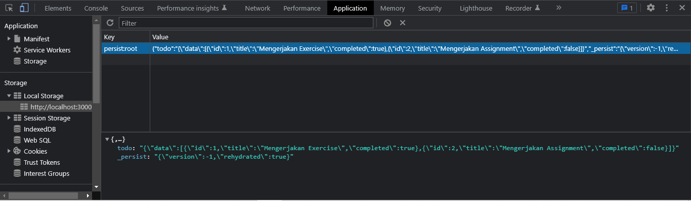

# Materi 17 - Global State Management

## Resume

### Global State Introduction

**Global State Management**

**Redux**

Redux adalah sebuah aplikasi state management. State management adalah cara untuk memfasilitasi komunikasi dan berbagai data lintas komponen.

**Kapan saat yang tepat untuk menggunakan Redux**

1. Banyak state yang perlu ditaruh di banyak tempat
2. State pada app sering berubah
3. Logic untuk mengubah state kompleks
4. Ukuran codebase yang sedang-besar, dan dikerjakan oleh banyak orang
5. Perlu untuk mengetahui bagaimana state diupdate seiring dengan waktu

**Redux Libraries dan Tools**

1. React-Redux
2. Redux Toolkit
3. Redux DevTools Extension

**Komponen Penting di Redux**

1. Actions
2. Reducer
3. Store

**Action**

Digunakan untuk memberikan informasi dari aplikasi ke store

```
const addTodoAction = {
    type: 'todos/todoAdded',
    payload: 'Buy milk'
}
```

```
const addTodo = text => {
    return {
    type: 'todos/todoAdded',
    payload: text
    }
}

const increment = () => {
    return {
        type: 'counter/increment'
    }
}
```

**Reducer**

Pure Javascript functions yang mengambil state aplikasi saat ini dan object action lalu mengembalikan state aplikasi terbaru

```
const initialState = { value: 0 }

function counterReducer(state = initialState, action) {
    if(action.type === 'counter/increment') {
        return {
            value: state.value + 1
        }
    }
    return state
}
```

**createSlice()**

```
import { createSlice } from '@reducjs/toolkit'

export const counterSlice = createSlice({
    name: 'counter',
    initialState: {
        value: 0
    },
    reducers: {
        increment: state => {
            state.value += 1
        },
        decrement: (state) => {
            state.value -= 1
        },
        incrementByAmount: (state, action) => {
            state.value => action.payload
        }
    }
})

export count { increment, decrement, incrementByAmount } = counterSlice.actions
export default counterSlice.reducer
```

**Store**

Objek sentral yang menyimpan state pada aplikasi

```
import { configureStore } from '@reduxjs/toolkit'

export default configureStore({
  reducer: counterReducer,
})
```

**Memasang Redux Store pad React**

```
root.render(
  <Provider store={store}>
    <App />
  </Provider>
  document.getElementById('root')
)
```

**Memakai dan mengubah state**

1. Hooks
2. Connect

**Hooks**

```
import React from 'react'
import { useSelector, useDispatch } from 'react-redux'
import { decrement, increment } from './counterSlice'
import styles from './Counter.module.css'

export function Counter() {
  const count = useSelector((state) => state.counter.value)
  const dispatch = useDispatch()

  return (
    <div>
      <div>
        <button
          aria-label="Increment value"
          onClick={() => dispatch(increment())}
        >
          Increment
        </button>
        <span>{count}</span>
        <button
          aria-label="Decrement value"
          onClick={() => dispatch(decrement())}
        >
          Decrement
        </button>
      </div>
    </div>
  )
}
```

**Connect**

1. `mapStateToPRops?: Function
2. `mapDispatchToProps?: Function | Object
3. mergeProps?: Function
4. options?: Object

```
import { connect } from 'react-redux'

const mapStateToProps = (state) => {
    return {
        count: state.counter.value
    }
}

const mapDispatchToProps = {
    increment,
}

export default connect(mapStateToProps, mapDispatchToProps)(Counter)
```

### Redux Thunk

Thunk Middleware untuk redux yang memungkinkan kita untuk membuat action creator yang mengembalikan function bukan action.

**Kenapa perlu Redux Thunk**

Untuk menghandle side effect logic seperti logic synchronous kompleks yang perlu mengakses store dan juga logic async seperti request data.

**Asynchronous Dispatch**

```
  const INCREMENT_COUNTER = 'INCREMENT_COUNTER';

  function increment() {
      return {
          type: INCREMENT_COUNTER,
      };
  }

  function incrementAsync() {
      return (dispatch) => {
          setTimeout(() => {
              dispatch(increment());
          }, 1000);
      };
  }
```

**Conditional Dispatch**

```
  function incrementIfOdd() {
      return (dispatch, getState) => {
          const { counter } = getState();

          if (counter % 2 === 0) {
              return;
          }

          dispatch(increment());
      };
  }
```

### Persisted State

**Menyimpan State ke storage**

```
  // store.js

  import { createStore, applyMiddleware } from "redux";
  import { persistStore, persistReducer } from "redux-persist"; // imports from redux-persist
  import storage from "redux-persist/lib/storage"; // defaults to localStorage for web

  import rootReducer from "./reducers"; // Root reducer

  const persistConfig = {
    // configuration object for redux-persist
    key: "root",
    storage, // define which storage to use
  };

  const persistedReducer = persistReducer(persistConfig, rootReducer); // create a persisted reduce

  const store = createStore(
    persistReducer, // pass the persisted reducer instead of rootReducer to createstore
    applyMiddleware() // add any middlewares here
  );

  const persistor = persistStore(store); // used to create the persisted store, persistor will be used in the next step

  export default (store, persistor);
```

```
  import { store, persistor } from "./redux/store";
  import { PersistGate } from "./redux-persist/integration/react";

  const App = () => {
    return (
      <Provider store={store}>
        <PersistGate loading={null} persistor={persistor}>
          {" "}
          // null passed to loading, persistor is being used here
          <RootComponent />
        </PersistGate>
      </Provider>
    );
  };
```

---

## Task

1. Soal untuk nilai Global State Management (REDUX) (skala 0-100)

   Tambahkan redux dan redux-persist pada assignment sebelumnya.

   

   

Jawaban kode: [store.js](./praktikum/src/store/index.js)

Output:

1. Tampilan To Do App

   

2. Tampilan Local Storage (redux-persist)

   
