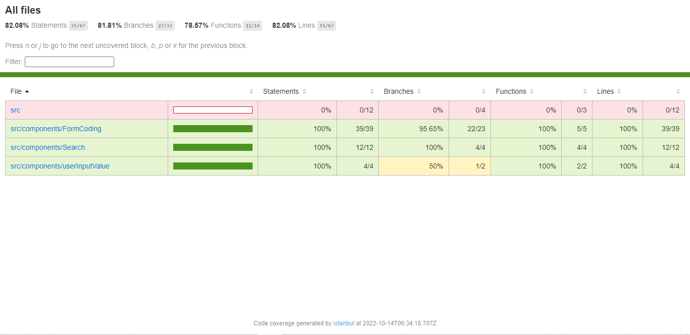

# Materi 18 - Testing

## Resume

### Testing Introduction

### Apa itu Testing?

Testing adalah proses memverifikasi bahwa test assertions kita benar dan bahwa code kita tetap benar sepanjang masa aplikasi. Test assertion ini adalah ekspresi boolean yang mengembalikan nilai true kecuali ada bug di kode kita.

**Manfaat Testing**

Walaupun menambahkan waktu dan code dalam membuat testing, testing memiliki manfaat sebagai berikut:

- Ketika aplikasi kita mempunyai coverage yang baik (mayoritas codebase tercover oleh test), kita akan merasa percaya diri jika harus mengubah suatu bagian pada aplikasi kita. Saat kita mengubah bagian tersebut, dan ada bagian yang lain menjadi broken kita akan segera mengetahuinya.
- Mengurangi bug pada aplikasi. Walaupun testing tidak menjamin aplikasi kita bebas bug, tetapi kita bisa mencegah beberapa hal yang berpotensi menjadi bug.

**Kategori Testing**

Secara umum, cara mengetes di React terbagi menjadi dua kategori:

1. **Rendering component trees** di dalam environment tes yang sudah disederhanakan dan ditegaskan pada keluarannya. Kita akan fokus pada bagian ini.

2. **Menjalankan aplikasi lengkap** di dalam environment peramban (browser) asli. Ini dikenal sebagai tes "end-to-end".

### Pertimbangan Memilih Tools

**Kecepatan iterasi vs enviroment yang realistis**

Beberapa tools menawarkan feedback loop yang sangan cepat antar membuat sebuah perubahan dan melihat hasilnya, tetapi tidak memodelkan sifat dari peramban dengan tepat. Tools lain mungkin menggunakan enviroment peramban yang asli, tetapi mengurangi kecepatan iterasi dan lebih flakier pada server integrasi berkelanjutan.

**Seberapa Banyak Mock**

Dengan komponen, perbedaan antara tes "unit" dan tes "integrasi" bisa tidak sesuai. Jika kita mengetes sebuah form, haruskah tes yang dilakukan juga menguji tombol yang ada di dalamnya? atau haruskah komponen memiliki rangkaian tes sendiri? Haruskah refactoring pada tombol merusak tes pada form.

Pertimbangan pemilihan tools untuk testing tentu saja dikembalikan kepada kebutuhan masing-masing.

### Rekomendasi Tools

**Jest**

Test runner pada Javascript yang memungkinkan Anda mengakses DOM melalui jsdom. Sementara jsdom hanyalah perkiraan cara kerja browser, seringkali cukup baik mengetes komponen pada React. Jest memberikan kecepatan iterasi yang bagus dikombinasikan dengan fitur-fitur yang powerful seperti mocking modules dan timers sehingga Anda dapat memiliki kontrol lebih pada kode yang dijalankan.

```
// math.js

function sum(x, y) {
    return x + y;
}
```

```
import sum from './math.js';

describe('sum', () => {
    test('sums up two values', () => {
        expect(sum(2, 4).toBe(6));
    });
});
```

**React Testing Library**

Merupakan seperangkat helpers yang memungkinkan kita mengetes komponen pada React tanpa bergantung pada detail implementasinya. Pendekatan ini membuat refactoring menjadi mudah dan juga mendorong kita untuk menerapkan best practices untuk aksesibilitas. Mungkin tidak memberikan cara untuk me-render secara "dangkal" pada sebuah komponen tanpa anak, test runner seperti jest yang memungkinkan kita melakukan mocking.

**Install**

Jika kita menginstall react menggunakan create-react-app, Jest (dan React Testing Library) akan secara default sudah terinstall. Tetapi jika kita menggunakan custom React setup, kita perlu menginstall dan men set up Jest (dan React Testing Library).

### Create basic testing with RTL

### Rendering Komponen

**Render dan Debug**

Fungsi render RTL akan merender file JSX apa pun yang dibutuhkan. Setelah itu, kita baru bisa memiliki akses ke komponen React yang akan kita test. Untuk meyakinkan bahwa file JSX sudah terender, kita bisa menggunakan fungsi debug RTL. Selalu gunakan fungsi debug RTL apabila kita tidak yakin seperti apa hasil dari fungsi render RTL.

React Testing Library digunakan untuk berinteraski dengan komponen kita seperti manusia. Itulah alasan kenapa kita melihat struktur HTML sebagai output dari fungsi render.

### Memilih Elemen

**Memilih Elemen**

React Testing Library menawarkan berbagaoo fungsi untuk mendapatkan elemen. Element selanjutnya digunakan untuk assertions atau untuk interaksi pengguna. Kita dapat memilih elemen dengan fungsi object screen RTL.

Salah satu contohnya ialah getByText untuk memilih teks dari elemen yang sudah dipilih.

**Kategori Testing**

Contoh lain yang bisa digunakan.

- **LabelText**: getByLabelText: `<label for="search" />`
- **PlaceholderText**: getByPlaceholderText: `<input placeholder="Search" />`
- **AltText**: getByAltText: ``
- **DisplayValue**: getByDisplayValue: `<input value="JavaScript" />`

### Testing Custom Hook

**Library yang Digunakan**

Untuk mengetes custom hook, kita menggunakan React Hooks Testing Library. Dia akan memberikan kita alat-alat untuk mengetes hooks tanpa merender satu komponen.

```
npm install -D @testing-library/react-hooks
```

[Dokumentasi React Hooks Testing Library](https://react-hooks-testing-library.com/)

---

## Task

**Assignment ReactJS Topic Testing**

Membuat file testing untuk code code yang telah diberikan.

Berikut merupakan code-nya:

1. [FormCoding.jsx](./praktikum/src/components/FormCoding/FormCoding.jsx)
2. [Search.jsx](./praktikum/src/components/Search/Search.jsx)
3. [userInputValue.js](./praktikum/src/components/userInputValue/useInputValue.js)

Berikut merupakan file testing dari code tersebut:

1. [FormCoding.test.js](./praktikum/src/components/FormCoding/__test__/FormCoding.test.js)
2. [Search.test.js](./praktikum/src/components/Search/__test__/Search.test.js)
3. [userInputValue.test.js](./praktikum/src/components/userInputValue/__test__/userInput.test.js)

Coverage:


