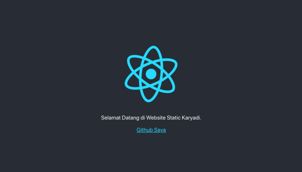

# Materi 19 - Deployment

## Resume

### Build React App

**Kenapa Perlu Build**

Secara default, React mengandung banyak pesan peringatan. Peringatan-peringatan ini sangat berguna dalam pengembangan aplikasi. Namun, pesan-pesan ini membuat React menjadi lebih bedar dan lambat. Oleh karenya kita harus menggunakan versi produksi ketika men-deploy apliaksi.

Tujuan melakukan build agar aplikasi kita menjadi versi production, sehingga performanya lebih ringan cepat.

**Build React App**
Karenanya proyek kita dibangun menggunakan Create react App,

```
npm run build
```

ini akan membuat versi produksi untuk aplikasi kita di dalam folder build/. Ini hanya diperlukan sebelum men-deploy ke produksi. untuk pengembangan normal, gunakan npm start.

**Run Optimized App**

Untuk menjalankan aplikasi yang optimal di lokal komputer kita, kita bisa menggunakan serve.

```
// install serve
npm install -g serve

// jalankan serve di lokal
serve -s build
```

### Deployment

**Apa itu deplyment**

Deployment adalah kegiatan yang bertujuan untuk menyebarkan aplikasi yang sudah kita buat. Harapannya aplikasi tersebut dapat diakses oleh banyak orang, tidak hanya oleh kita sendiri.

### Deplyment dengan Surge

**Apa itu Surge**

Surge adalah layanan penerbit website statik (static web publishing) gratis untuk Front-End Developers. Website statik yang mengggunakan surge akan memiliki subdomain \*.surge.sh. Surge sapat menerima file HTML, CSSm dan JS.

**Install Surge**

1. Pastikan menggunakan versi Node yang terbaru.
2. Install Surge di terminal.

```
npm nstall --global surge
```

**Deploy dengan surge**

Jalankan perintah `surge` di terminal.

**Teardown Surge**

Terkadang kita tidak ingin mempublikasikan sebagian domain atau subdomain. Untuk itu kita bisa teardown sebuah project melalui surge CLI. Ini efektif membuat proyek kita offline.

```
surge terdown vacouver.surge.sh
```

### Deployment dengan Netlify CLI

**Apa itu Netlify**

Netlify adalah salah satu platform penyedia layanan build tools sekaligus Continous Deployment. Netlify memungkinkan kita untuk mempublish website statis secara gratis. Netlify juga sudah terintegrasi dengan Git Host popular seperti Github, Gitlab dan Bitbucket.

**Deploy dengan Netlify**

1. Buat akun Netlify ([www.netlify.com](www.netlify.com))
2. Install Netlify CLI di terminal
   ```
   npm install netlify-cli -g
   ```
3. Jalankan perintah `netlify deploy` di terminal.
4. Verify akun melalui browser, pilih Authorize.
5. Pilih "Create & configure a new site".
   Untuk team, pilih yang sudah tersedia. Site name opsional.
6. Pilih lokasi file yang akan di deploy. Pilih ./build.

---

## Task

**Assignment ReactJS Topic Deployment**

Deploylah code create react project yang sedikit diubah. Deploy menggunakan Surge/Netlify. Link deploy memiliki format “taskDeploy-namaKalian”, kemudian dikumpulkan.

**Contoh Tampilan**

Ini merupakan contoh tampilan create react project yang sedikit diubah. Kalian bisa menjadikan referensi. Bisa juga menyesuaikan selera teman teman. Perlu diketahui yang menjadi komponen utama penilaiannya ialah deployment, bukan tampilan create react project yang teman teman ubah.



Berikut link hasil dari deployment:

[https://taskdeploy-harie-fairuzzaki.netlify.app](https://taskdeploy-harie-fairuzzaki.netlify.app)
