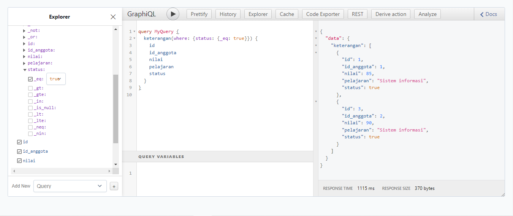
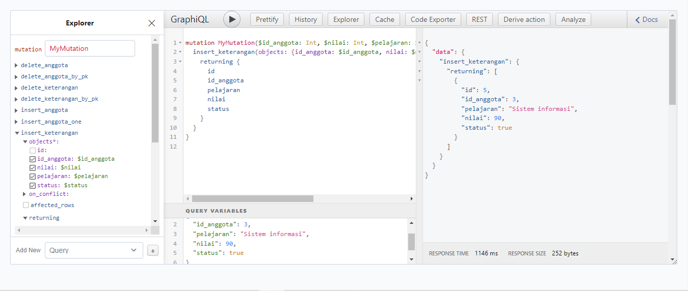
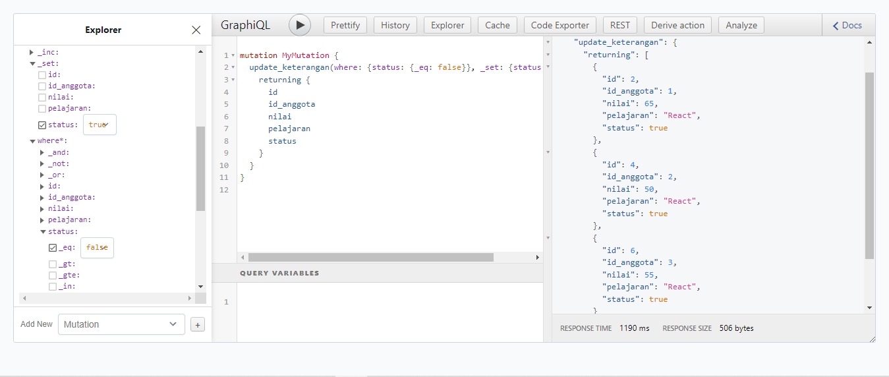
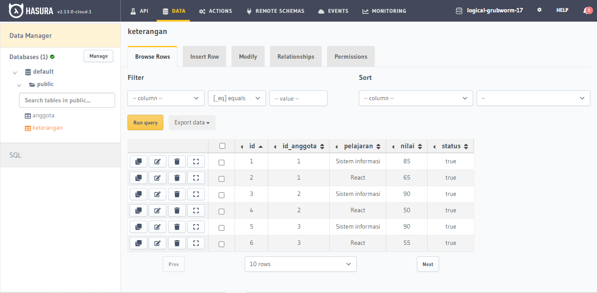

# Materi 20 - GraphQL Basic

## Resume

### React JS & GraphQL

**What is GraphQL**

GraphQL is a query language for your API, and a server-side runtime for executing queries by using a type system you define for your data. GraphQL minimizes the amount of data that needs to be transferred over the network. With graphQL we can use one single endpoint (/graphQL) for any request needed.

**GraphQL Core Features**

Before we can do GraphQL then we need to setup GraphQL Server (Backend), you can use Hasura. Apollo server or others to do that. Then we can use GraphQL on client either using Prisma, Apollo Client, Postman, etc.

There are 3 main features in GraphQL client:

1. **Query**, get data based on specific query that we define.
2. **Mutation**, insert, update, delete data.
3. **Subscription**, get updated date realtime / based on events.

**Query - Basics**

With graphQL we can get data exactly what we need. We define what fields that we want to get and graphQL will give us data based on what we define. For example, imagine there is one collection in database that holds movies data. All unneeded data like director, created_at and updated_at can will not be included in the result.

**Query - multiple related data sources / collections**

We can also use query to get data from multiple related collections. In the example below, if we want to get director data we need to use director.id to get data from other endpoint, but with graphql we can also define needed fields directly as long as it’s available on GraphQL server.

**Query - multiple unrelated data sources / collections**

We can also use query to get data from multiple unrelated collections for minimizing network request. Image if we want movies data and books data. With REST we need to do at least 2 request to 2 different endpoints. With GraphQL we can do 1 request to get those data.

**Query - fragments**

A GraphQL fragment is a piece of logic that can be shared between multiple queries and mutations. We can use fragment to simplify query or mutation.

**Mutation**

Mutation is basically functionality to update, insert and delete data. We need to define what operation that we want to do (based on available operation on your graphql server) and then define what data GraphQL need to return.

**Subscription**

Subscriptions are a GraphQL feature that allows a server to send data to its clients when a specific event happens. Subscriptions are usually implemented with WebSockets. In that setup, the server maintains a steady connection to its subscribed client.

When data is modified then client will get updated data directly in real-time. In example below, if we do subscription on person collection then everytime new person is added or when data is deleted or modified then we will get updated data real-time directly to our client. Subscription will only happen on client side not server side.

**What is Hasura & Heroku**

Hasura is a service provide graphql and rest api. Full managed on hasura cloud or self-hosted. Open https://hasura.io/ and create new your own graphql server

Heroku is a cloud platform as a service supporting several programming languages. Heroku also provide free postgres database. Open https://heroku.com/ and create your own service

**What is Apollo**

Apollo Client is a comprehensive state management library for JavaScript that enables us to manage both local and remote data with GraphQL. Use it to fetch, cache, and modify application data, all while automatically updating UI. The core @apollo/client library provides built-in integration with React. We an use Apollo client to do any GraphQL operations (query, mutation and subscription) inside our React or Next JS app. Apollo client works well with any GraphQL server (Hasura, Apollo Server, etc)

---

## Task

1. Masuk ke hasura dan buatlah sebuah database bernama kampus_merdeka
2. Buat table anggota yang berisikan id(primary key, auto increment) dan nama.
3. Buat table keterangan yang berisikan id(primary ket, auto increment), id_anggota, pelajaran, nilai, status(boolean).
4. Masukkan 3 buah data pada tabel anggota.

   | id  | nama  |
   | --- | ----- |
   | 1   | Budi  |
   | 2   | Sita  |
   | 3   | Angga |

5. Masukkan data di bawah

   | id  | id_anggota | pelajaran        | nilai | status |
   | --- | ---------- | ---------------- | ----- | ------ |
   | 1   | 1          | Sistem informasi | 85    | true   |
   | 2   | 1          | React            | 65    | false  |
   | 3   | 2          | Sistem informasi | 90    | true   |
   | 4   | 2          | React            | 50    | false  |

6. Lakukan query untuk memanggil hanya siswa yang memiliki status true.
7. Lakukan insert kepada angga dengan mutation sehingga memiliki data berikut.

   | id  | id_anggota | pelajaran        | nilai | status |
   | --- | ---------- | ---------------- | ----- | ------ |
   | 5   | 3          | Sistem informasi | 90    | true   |
   | 6   | 3          | React            | 55    | false  |

8. Dengan menggunakan mutation lakukan update terhadap data yang memiliki nilai false menjadi true.

Lakukan screenshot setiap query dan tampilan dari query tersebut. Kumpulkan foto dari screenshot kamu lakukan. Simpan setiap query yang kamu gunakan ke dalam json file.

---

1. query siswa yang memiliki status true.

   

   => [file json, query siswa yang memiliki status true](./praktikum/retrieve.json)

2. insert kepada angga dengan mutation.

   - insert pelajaran Sistem informasi

     

     => [file json, insert sistem infromasi](./praktikum/insert_sistem-informasi.json)

   - insert pelajaran React

     

     => [file json, insert react](./praktikum/insert_react.json)

3. update terhadap data yang memiliki nilai false menjadi true dengan mutation.

   

   => [file json, update status](./praktikum/update.json)

4. database

   
