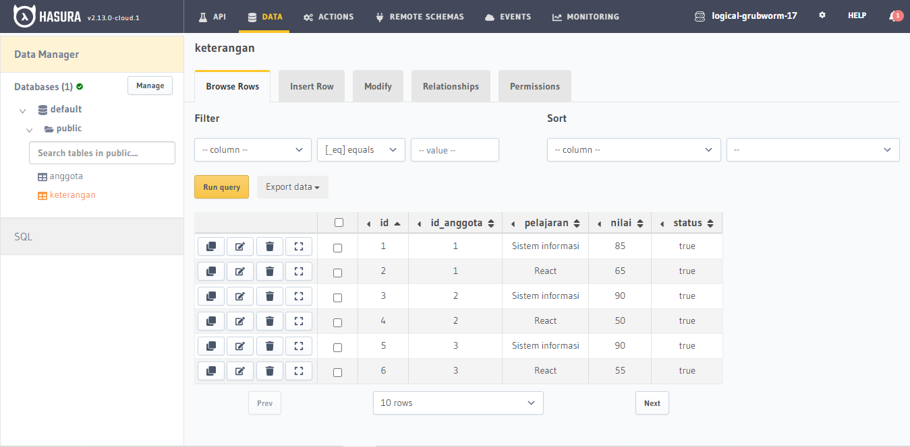
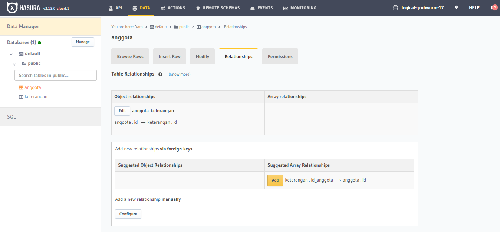
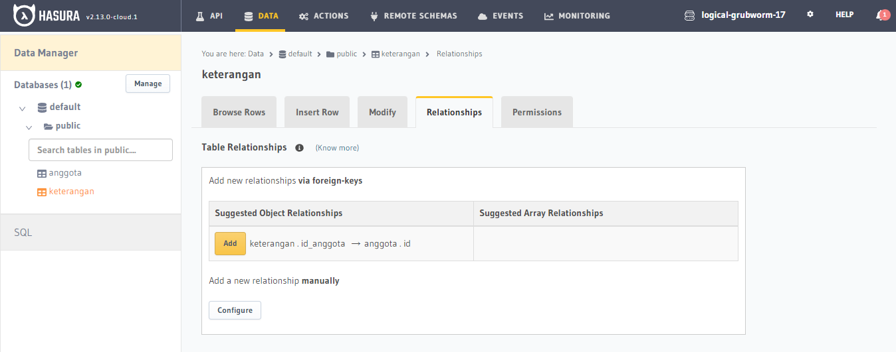
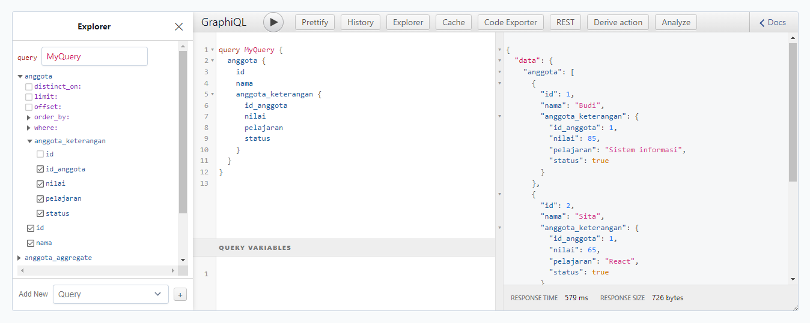

# Materi 21 - Relational Database

## Resume

### Database: Schema & Data Definition Language

Database adalah sekumpulan data yang terorganisir.

Database relasional adalah kumpulan item data dengan hubungan yang telah ditentukan sebelumnya. Berbagai item ini disusun menjadi satu set tabel dengan kolom dan baris. Tabel digunakan untuk menyimpan informasi tentang objek yang akan direpresentasikan dalam database.

Tiap kolom pada tabel memuat jenis data tertentu dan bidang menyimpan nilai aktual atribut. Baris pada tabel merepresentasikan kumpulan nilai terkait dari satu objek atau entitas. Tiap baris pada tabel dapat ditandai dengan pengidentifikasi unik yang disebut primary key, dan baris di antara beberapa tabel dapat dibuat saling terkait menggunakan foreign key. Data ini dapat diakses dengan berbagai cara tanpa menyusun ulang tabel basis data itu sendiri.

### Database Relationship

1. One to One Relationship

   Relasi One to One adalah relasi dimana suatu baris tabel A hanya berhubungan dengan suatu baris tabel B.

2. One to Many Relationship

   Relasi One to Many adalah relasi dimana suatu baris di table A memiliki relasi di beberapa baris di table B.

3. Many to Many Relationship

   Relasi Many to Many adalah relasi dimana setiap lebih dari satu baris data dari tabel A berhubungan dengan lebih dari satu baris data pada tabel B. Artinya, kedua tabel masing-masing dapat mengakses banyak data dari tabel yang direlasikan. Maka dari itu, relasi Many to Many butuh tabel C sebagai perantara tabel A dan tabel B.

### Relational Database Management Systems (RDBMS)

Software yang menggunakan Relational Database Model sebagai dasarnya. Contoh: MySQL.

**Jenis Perintah SQL**

1. DDL (Data Definition Language)

2. DML (Data Manipulation Language)

3. DCl (Data COntrol Language)

**DDL Statement**

```
CREATE DATABASE database_name;

USE database_name;

CREATE TABLE ...

DROP TABLE ...

RENAME ...
```

**Create Table with is Schema**

```
CREATE TABLE table_name(
    column1 data_type PRIMARY KEY,
    column2 data_type FOREIGN KEY,
    ...
    column data_type,
    PRIMARY KEY(one or more columns)
);
```

**Modify Table Schema**

```
ALTER TABLE table_name

ADD COLUMN column_name
data_type;
```

**Tipe Data MySQL**

Num, Huruf, Date

**DML (Data Manipulation Language)**

Perintah yang digunakan untuk memanipulasi data dalam tabel dari suatu database.

**Statement Operation**

1. INSERT

   Input data ke table user

   ```
   INSERT INTO USERS
   (username, fullname, status, gender, email, password, location)
   VALUES ('hadildo', 'Nurhadi Aldo', 1, 'm', 'hadildo@tronjaltronjol.com', '123456', 'Jawa Timur')
   ```

2. SELECT

   Menampilkan semua data pada tabel user

   ```
   SELECT * FROM USERS
   ```

   Menampilkan username dan fullname pada table user yang id nya 1

   ```
   SELECT username, fullname
   FROM USERS WHERE id=1
   ```

   Menampilkan username dan fullname dari table user yang usernamenya tidak kosong

   ```
   SELECT username, fullname
   FROM users WHERE fullname IS NOT NULL
   ```

3. UPDATE

   Ubah data fullname ke tabel user dengan id 1

   ```
   UPDATE users SET
   fullname='Nurhadi Aldo Tronjal Tronjol' WHERE id = 1
   ```

4. DELETE

   Hapus data pada tabel user dengan id 1

   ```
   DELETE FROM users
   WHERE id = 1
   ```

**DML Statement**

1. LIKE/BEETWEN

   Tampilkan data user_id dan message table tweets yang message mengandung huruf H didepan

   ```
   SELECT user_id, type, message, parent_id
   FROM tweets WHERE message LIKE 'H%'
   ```

   Tampilkan data user_id dan message table tweets yang user_id antara 1 dan 3

   ```
   SELECT user_id, type, message, parent_id
   FROM tweets WHERE user_id BETWEEN 1 AND 3
   ```

2. AND/OR

   Tampilkan data user_id dan message table tweets yang message mengandung huruf H didepan `atau` user_id antara 1 dan 3

   ```
   SELECT user_id, type, message, parent_id
   FROM tweets WHERE message LIKE 'H%' OR user_id BETWEEN 1 AND 3
   ```

   Tampilkan data user_id dan message table tweets yang message mengandung huruf H didepan `dan` user_id antara 1 dan 3

   ```
   SELECT user_id, type, message, parent_id
   FROM tweets WHERE message LIKE 'H%' AND user_id BETWEEN 1 AND 2
   ```

3. ORDER BY

   Tampilkan data user_id dan message table tweets yang message mengandung huruf H didepan `atau` user_id antara 1 dan 3 diurutkan berdasarkan id tweets berurutan dari terbesar ke terkecil

   ```
   SELECT id, user_id, type, message, parent_id
   FROM tweets
   WHERE message LIKE 'H%' OR user_id
   BETWEEN 1 AND 2 ORDER BY id DESC
   ```

4. LIMIT

   Tampilkan data user_id dan message table tweets yang message mengandung huruf H didepan `atau` user_id antara 1 dan 3 diurutkan berdasarkan id tweets berurutan dari terbesar ke terkecil dibatasi 2 data

   ```
   SELECT id, user_id, type, message, parent_id
   FROM tweets
   WHERE message LIKE 'H%' OR user_id
   BETWEEN 1 AND 2 ORDER BY id DESC
   LIMIT 2
   ```

### JOIN

**JOIN**

Sebuah klausa untuk mengkombinasikan record dari dua atau lebih tabel

**JOIN STANDAR SQL ANSI**

1. INNER JOIN

   Inner join akan mengembalikan baris-baris dari dua table atau lebih yang memenuhi syarat

   ```
   SELECT t.message FROM users u
   INNER JOIN tweets t
   ON u.id = t.user_id;
   ```

2. LEFT JOIN

   Left join akan mengembalikan seluruh baris dari tabel disebelah kiri yang dikenai kondisi ON dan hanya baris dari tabel disebelah kanan yang memenuhi kondisi join.

   ```
   SELECT u.username, t.message
   FROM users u
   LEFT JOIN tweets t
   ON u.id = t.user_id;
   ```

3. RIGHT JOIN

   Right join akan mengembalikan seluruh baris dari tabel disebelah kanan yang dikenai kondisi ON dengan data dari tabel sebelah kiri yang memenuhi kondisi join.Teknik ini merupakan kebalikan dari left join.

   ```
   SELECT u.username, t.message
   FROM users u
   RIGHT JOIN tweets t
   ON u.id = t.user_id;
   ```

4. UNION

   Ada hal yang perlu diperhatikan dari union adalah jumlah field yang dikeluarkan/dipanggil harus sama.

   ```
   SELECT username, fullname
   FROM users WHERE id = 1
   UNION
   SELECT username, fullname
   FROM users WHERE id = 2
   ```

### AGGREGATE

**Fungsi Agregasi**

Fungsi dimana nilai beberapa baris dikelompokkan bersama untuk membentuk nilai ringkasan tunggal

**Fungsi Agregasi SQL**

1. MIN

   Fungsi dimana nilai beberapa baris dikelompokkan bersama untuk membentuk nilai ringkasan tunggal.

   Tampilkan id terkecil dari tabel users

   ```
   SELECT MIN(id) AS id FROM users
   ```

   Tampilkan created_at terkecil dari tabel users

   ```
   SELECT MIN(created_at) AS created_at FROM users
   ```

2. MAX

   Digunakan untuk mendapatkan nilai maximum atau nilai terbesar dari sebuah data record di tabel.

   tampilkan nilai id terbesar dari tabel users

   ```
   SELECT MAX(id) FROM users
   ```

   Tampilkan nilai created_at terbesar dari tabel users

   ```
   SELECT MAX(created_at) FROM users
   ```

3. SUM

   Digunakan untuk mendapatkan jumlah total nilai dari sebuah data atau record di tabel.

   Tampilkan jumlah total favourite_count dari tabel tweets dengan user_id 1

   ```
   SELECT SUM(favourite_count) FROM tweets WHERE user_id = 1
   ```

4. AVG

   Digunakan untuk mencaro nilai rata-rata (average) dari sebuah data atau record di tabel.

   Tampilkan nilai rata-rata favourite_count dari tabel tweets dengan user_id 1

   ```
   SELECT AVG(favourite_count) FROM tweets WHERE user_id = 1
   ```

5. COUNT

   Digunakan untuk mencari jumlah dari sebuah data atau record di tabel.

   Tampilkan jumlah data dari tabel tweets dengan user_id 1

   ```
   SELECT COUNT(1) FROM tweets WHERE user_id = 1
   ```

6. HAVING

   Digunakan untuk menyeleksi data berdasarkan kriteria tertentu, dimana kriteria berupa fungsi aggregat.

   Tampilkan data dari tabel tweets dengan jumlah total favourite_count per user lebih dari 2

   ```
   SELECT user_id FROM tweets
   GROUP BY user_id
   HAVING SUM(favourite_count) > 2
   ```

### SUBQUERY

**SUBQUERY**

Subquery atau Inner query atau Nested query adalah query di dalam query SQL lain

Sebuah Subquery digunakan untuk mengembalikan data yang akan digunakan dalam query utama sebagai syarat untuk lebih membatasi data yang akan diambil.

Subquery Dapat Digunakan dengan SELECT, INSERT, UPDATE dan DELETE statements bersama dengan operator seperti

```
=,
<, >,

> =, <=,
> IN, BETWEEN dll.

```

### PERATURAN YANG HARUS DITAATI

**PERATURAN**

- Harus tertutup dalam tanda kurung.
- Sebuah subquery hanya dapat memiliki satu kolom pada klausa SELECT, kecuali beberapa kolom yang di query utama untuk subquery untuk membandingkan kolom yang dipilih.
- Subqueries yang kembali lebih dari satu baris hanya dapat digunakan dengan beberapa value operator, seperti operator IN.
- Daftar SELECT tidak bisa menyertakan reerensi ke nilai-nilai yang mengevaluasi ke BLOB, ARRAY, CLOB, atau NCLOB.
- Sebuah subquery tidak dapat seger tertutup dalam fungsi set.

**CONTOH**

Tampilkan data tabel users yang user_id nya ada pada tabel tweets

```

SELECT \* FROM users WHERE id IN
(SELECT user_id FROM tweets GROUP BY user_id);

```

Tampilkan data tabel users yang jumlah total favourite_count per user lebih dari 5 pada tabel tweets

```

SELECT \* FROM users WHERE id
IN (SELECT user_id FROM tweets GROUP BY user_id HAVING SUM(favourite_count) > 5);

```

## FUNCTION

**FUNCTION**

Sebuah kumpulan statement yang akan mengembalikan sebuah nilai balik pada pemanggilnya

**CONTOH**

Function untuk mengembalikan jumlah data dari tweets per user

```

DELIMITER $$
CREATE FUNCTION sf_count_tweet_peruser
(user_id_p int) RETURNS INT DETERMINISTIC
BEGIN
DECLARE total INT;
SELECT COUNT(*) INTO total FROM tweets
WHERE user_id = user_id_p AND
type = 'tweets';
RETURN total;
END $$
DELIMITER;

```

**PENJELASAN**

DELIMITER,
memberitahu kepada mysql soal delimiter yang digunakan, secara default menggunakan ; jadi bila ada tanda ; mysql akan mengartikan akhir dari statement, pada contoh di atas delimiter yang digunakan $$ jadi akhir statementnya adalah $$

CREATE FUNCTION,
adalah header untuk membuat function

RETURN,
adalah untuk menentukan tipe data yang di return-kan oleh function

DETERMINISTIC/NOT DETERMINISTIC,
adalah untuk menentukan yang bisa menggunakan function ini adalah user pembuatnya saja (deterministric) atau user siapa saja (not destriministric)

BEGIN END,
adalah body dari function jadi semua SQL nya ditulis disini

```

SELECT sf_count_tweet_peruser(2);

```

\*Akan menampilkna jumlah tweets user id 2

**CONTOH**

Buat Trigger Function untuk delete data yang berhubungan dengan table users yang sedang di delete datanya

```

DELIMITER $$
CREATE TRIGGER delete_all_data_user
BEFORE DELETE ON users FOR EACH ROW
BEGIN
-- declare varibles
DECLARE v_user_id INT;
SET v_user_id = OLD.id
-- trigger code
DELETE FROM tweets WHERE user_id = v_user_id;
DELETE FROM user_followers WHERE
user_id = v_user-id;
END $$

```

**PENJELASAN**

DELIMITER,
memberitahu kepada mysql soal delimiter yang digunakan, secara default menggunakan ; jadi bila ada tanda ; mysql akan mengartikan akhir dari statement, pada contoh di atas delimiter yang digunakan $$ jadi akhir statementnya adalah $$

CREATE TRIGGER,
adalah header untuk membuat trigger function

DECLARE,
adalah syntax untuk mendeclare kan sesuatu hal/variabel

OLD,
adalah variabel yang menyimpan nilai dari dalam data yang sedang berinteraksi/dipanggil

NEW,
adalah variabel yang menyimpan nilai dari data yang baru masuk/sedang di input

BEGIN END,
adalah body dari function jadi semua SQL nya di tulis disini

---

## Task

Relation Database with Hasura

Masih pada database kampus_merdeka. Lakukanlah hal-hal berikut

1. Lakukan relasi database one to one, yang mana akan menghubungkan
   id_anggota pada tabel keterangan dengan nama pada tabel anggota.
2. Lakukan relasi database one to many, yang mana akan menghubungkan id pada
   tabel anggota dengan pelajaran pada tabel keterangan.

Screenshot:

1. Database

   

2. Relation Table Anggota

   `one-to-many` dimana `anggota.id` berelasi dengan `keterangan.id`

   

3. Relation Table Keterangan

   `one-to-one` dimana `keterangan.id_anggota` berelasi dengan `anggota.id`,

   melalui `keterangan.id_anggota` sebagai `foreign key` dan `anggota.id` sebagai `primary key`.

   

4. Query Table Anggota - Keterangan

   
