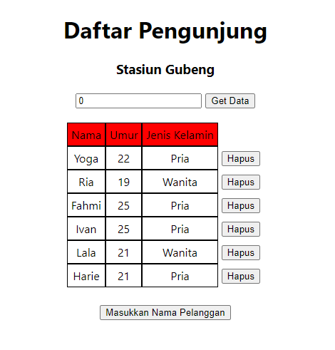
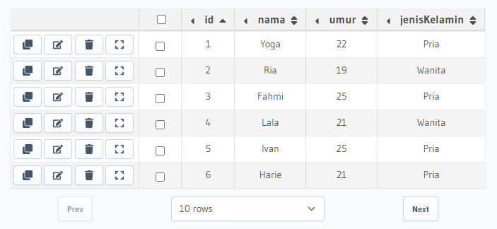

# Materi 22 - GraphQL - Query and Apollo client

## Resume

### What is Hasura & Heroku

Hasura is a service provide graphql and rest api. Full managed on hasura cloud or self-hosted. Open https://hasura.io/ and create new your own graphql server.

Heroku is a cloud platform as a service supporting several programming languages. Heroku also provide free postgres database. Open https://heroku.com/ and create your own service.

**Setting hasura and heroku**

After finish register hasura and heroku, open hasuran and create new project. When finish launch console and setting database server. Click tab data and create heroku database. When it’s done create database, you can configure your database.

Open tab API, use endpoint and header x-hasura-admin-secret as header

**Make as hasura public API**

To change hasura public API, open https://cloud.hasura.io/projects and open configuration

Open Env vars, click HASURA_GRAPHQL_ADMIN_SECRET then click delete icon, open console then your graphql public now

**Query and Mutation**

Open tab API, write your query or just click in explorer then click execute. Create mutation query to insert new data or update data

## Apollo Setup

**What is Apollo**

Apollo Client is a comprehensive state management library for JavaScript that enables us to manage both local and remote data with GraphQL. Use it to fetch, cache, and modify application data, all while automatically updating UI. The core @apollo/client library provides built-in integration with React. We an use Apollo client to do any GraphQL operations (query, mutation and subscription) inside our React or Next JS app. Apollo client works well with any GraphQL server (Hasura, Apollo Server, etc).

**Apollo Client Next JS Setup - Installation**

1. Create new React JS project
   **npx create-react-app react-graphql**
2. Install GraphQL and apollo client
   **yarn add graphql @apollo/client**
3. Don’t forget to commit changes to track progress

**Apollo Client Next JS Setup**

1. Go to src folder `npm i @apollo/client` and `npm i graphql`
2. Create apollo-client.js file inside src folder

   

3. Create apolloClient and export

   

   - **uri** specifies the URL of our GraphQL server
   - **cache** is an instance of InMemoryCache, which Apollo Client uses to cache query results after fetching them
   - **header** to identify yourself when using HTTP is to send. Add hasura secret every http request for authentication.

4. Setting apollo provider, in index.js import ApolloProvider, and apollo-client

   

   ApolloProvider wraps your React app and places Apollo Client on the context, which enables you to access it from anywhere in your component tree.

### Query

**Query with Apollo Client**

1. Import gql and useQuery then write your query, or you can copy from hasura console instead.

   

2. Get initial data by doing query on the server, call useQuery in top of your code.

   

   - **data**: An object containing the result of your GraphQL query after it completes
   - **error**: If the query produces one or more errors, this object contains array of errors
   - **loading**: If true, the query is still in flight and results have not yet been returned.

3. Consume data in your jsx code, note that in first request data is null so need use optional chaining to avoid error.

   

**Query with Apollo Client - lazy query**

When React renders a component that calls useQuery, Apollo Client automatically executes the corresponding query. But what if you want to execute a query in response to a different event, such as a user clicking a button?

The useLazyQuery hook is perfect for executing queries in response to events besides component rendering. Unlike with useQuery, when you call useLazyQuery, it does not immediately execute its associated query. Instead, it returns a query function in its result tuple that you call whenever you're ready to execute the query.

**Query with Apollo Client - refetching**

Refetching enables you to refresh query results in response to a particular user action, as opposed to using a fixed interval. You can optionally provide a new variables object to the refetch function. If you don't, the query uses the same variables that it used in its previous execution.

---

## Task

Components diberikan soal.

1. Hubungkan project react yang ada di atas dengan GraphQL.
2. Lakukan query pada database kalian. Sehingga, ketika aplikasi pertama kali dibuka, aplikasi kalian langsung melakukan fetch data dan menampilkannya pada layar.
3. Buatlah fitur melakukan query berdasarkan inputan dari user. Sehingga, dapat menampilkan data sesuai dengan input berdasarkan id.

Kode:

1. Apollo Client => [Apollo Client](./praktikum/src/apolloCLient/apolloClient.js)
2. Fetching Data => [Fetching Data](./praktikum/src/component/ListPassenger.js)

Output:

1. Tampilan Awal.

   

2. Menampilkan data sesuai dengan input berdasarkan id.

   

3. Database.

   
