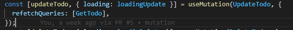

# Materi 23 - GraphQL Mutation

## Resume

### Mutation with Apollo Client

**Mutation Insert Data with Apollo Client**

1. Import useMutation hooks from apollo client and define mutation.

   

2. Invoke useMutation and using array destruction define mutation handler (insertTodo) and use it.

   

   refetchQueries: An array (or a function that returns an array) that specifies which queries you want to refetch after the mutation occurs.

3. Call insertTodo with variables.

   

**Mutation Update Data with Apollo Client**

1. Define update query

   

2. Create mutation handler for update todo

   

3. Call update query

   

**Mutation Delete Data with Apollo Client**

1. Define delete query

   

2. Create mutation handler for delete todo

   

3. Call delele query

   

---

## Task

1. Dengan menggunakan project react yang telah kalian buat di task: GraphQL Query. Lakukan mutation pada project tersebut.
2. Buatlah fitur submit pada tabel pengunjung stasiun kalian.
3. Buatlah fitur delete pada tabel pengunjung stasiun kalian.
4. Buatlah fitur edit pada tabel pengunjung stasiun kalian.

### Tampilan

1. Tampilan Awal

   

2. Tampilan untuk Insert Passenger

   

3. Tampilan untuk Update Passenger

   
