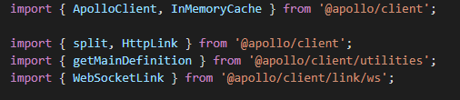
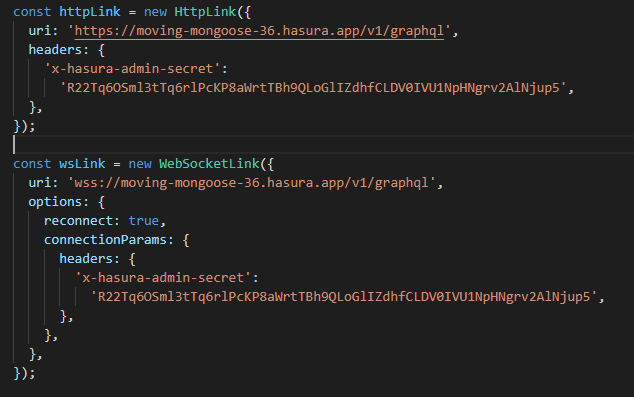
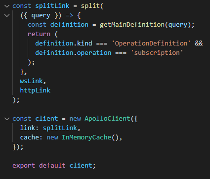
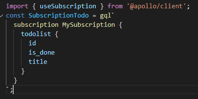
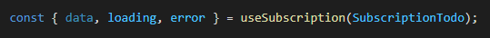
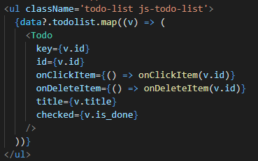
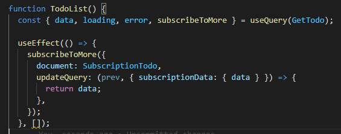
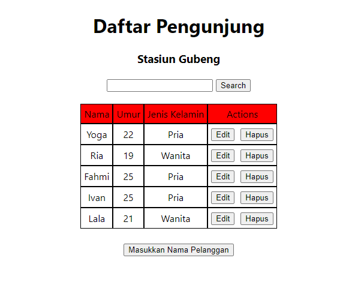
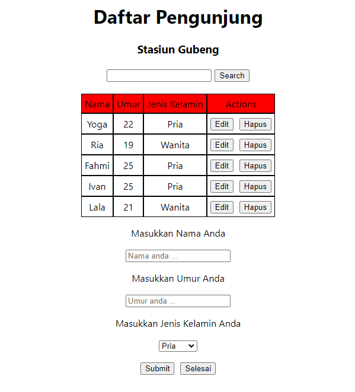
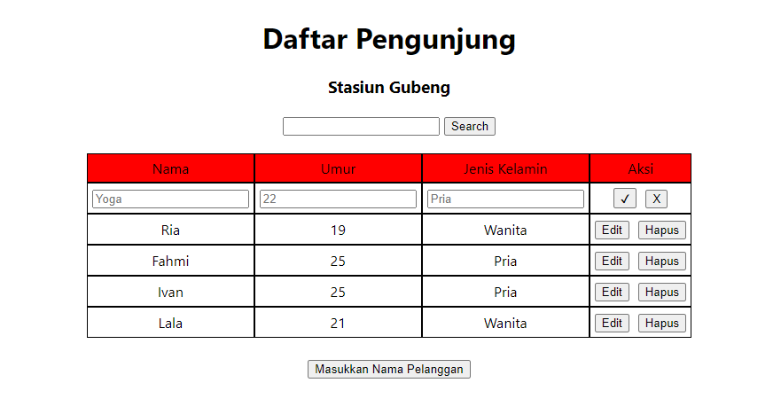

# Materi 24 - GraphQL Subscription

## Resume

### Subscription

**Setting Subscription**

1. Install subscriptions-transport-ws to enable websocket connection

   **yarn add @apollo/client subscriptions-transport-ws**

2. Import all needed modules and separate between http and websocket link

   

**Subscription**

3. Create httpLink for query and mutation. And wsLink for subscription. Add header for authentication. Get this link from your hasura console. WsLink use wss:// instead of https:// because wsLink use websocket.. Note that wss is more secure than ws, just like https is more secure than http.

   

4. Add split function and use as link when create client. Split function used to combine those two Links into a single Link that uses one or the other according to the type of operation being executed . When operation is equal subscription then use wsLink, if not then use httpLink for query and mutation

   

**Subscription using useSubscription**

5. Import useSubscription from apollo client and define subscription

   

6. Invoke subscription and consume data, in this example we will remove query from previous code and change it to subscription. In jsx code just like before

   

   

**Subscription using subscribeToMore**

subscribeToMore is a function that enables you to execute a subscription, usually to subscribe to specific fields that were included in the query. Or when server return only 1 updated data instead of all data, then we need to update previous data in prev variable and return updated data.

---

## Task

1. Lakukan Subscription pada project yang kalian pakai sebelumnya.

### Tampilan

1. Tampilan Awal

   

2. Tampilan untuk Insert Passenger

   

3. Tampilan untuk Update Passenger

   
