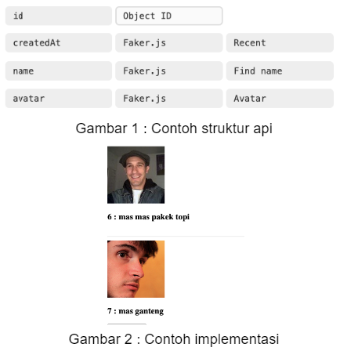
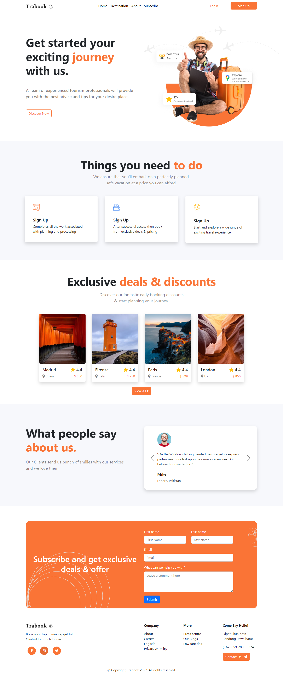
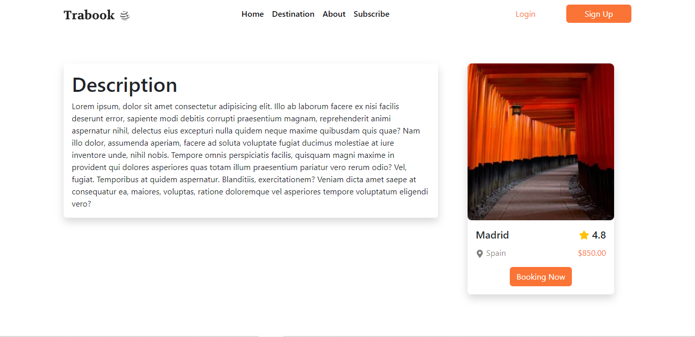
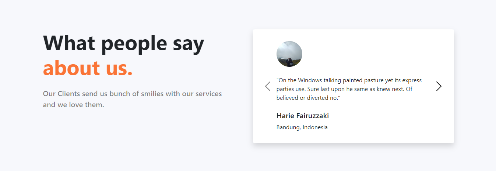
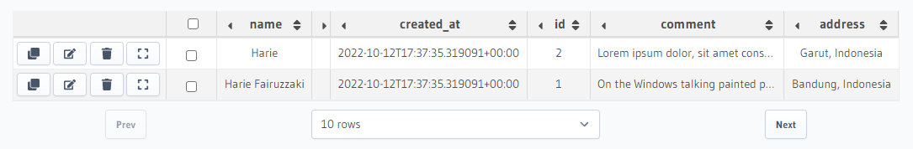
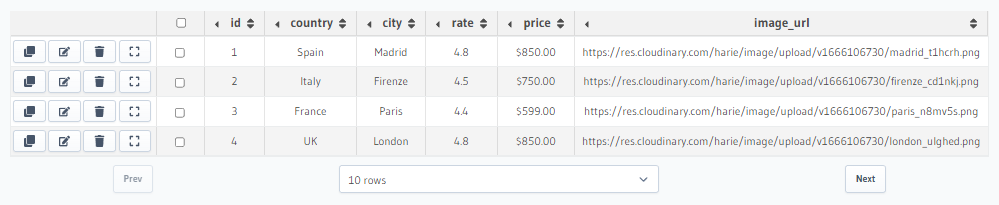

# Weekly Task 3

## Objective

Masih meneruskan weekly task 2 dan buatlah beberapa fitur lain. Kalian diharuskan menerapkan routing dan dynamic routing. Semua fitur dibuat menggunakan react dan pastikan structure dan library yang digunakan berjalan secara maksimal.

## Criteria

1.  Buat folder weekly3 yang berisikan tugas dari weekly task 3.

    - Buat folder project yang berisikan kode yang kalian buat.
    - Buat folder screenshot dan masukkan hasil dari kode yang kalian buat.

    

2.  Lakukan fetching data menggunakan public api, dan buatlah route baru yang berisikan data dari public api tersebut.
3.  Buatlah data user dengan hasura. Dan lakukan fetching data dari data tersebut ke dalam halaman about us.

    - Struktur terdiri dari id, createAt, nama dan avatar (img)

      

4.  Gunakan global state yang kalian pelajari dalam kelas untuk pengolahan data dan method/function yang gunakan.

---

## Code

Melanjutkan weekly task 2, project menggunakan React, Redux, Axios, React Router.

## Tampilan

1. Fullscreen

   

2. Detail Destination

   

3. About Us

   

4. Database

   

   
