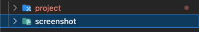
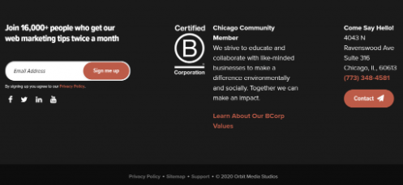
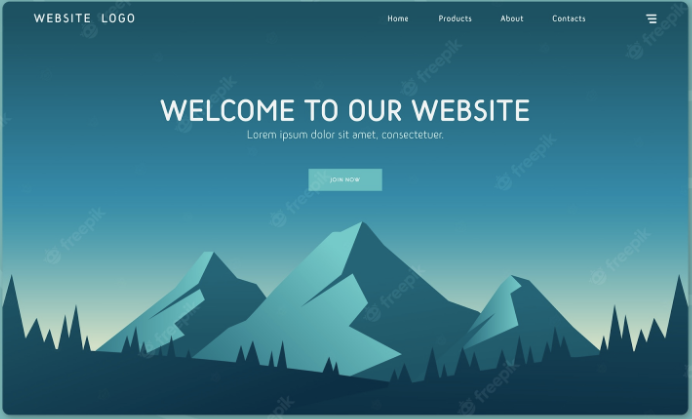
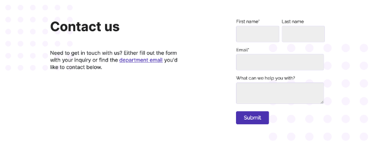
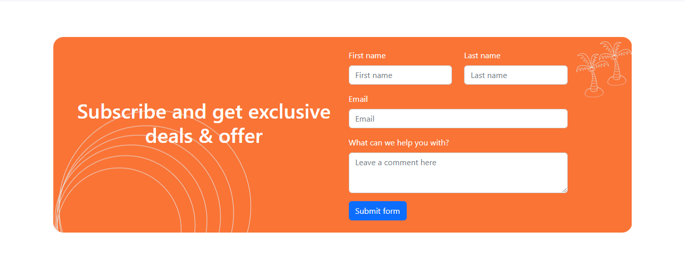
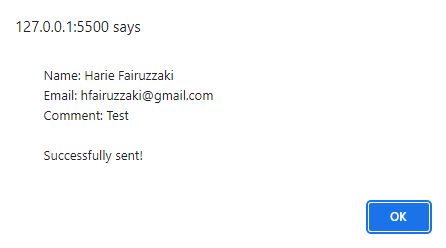
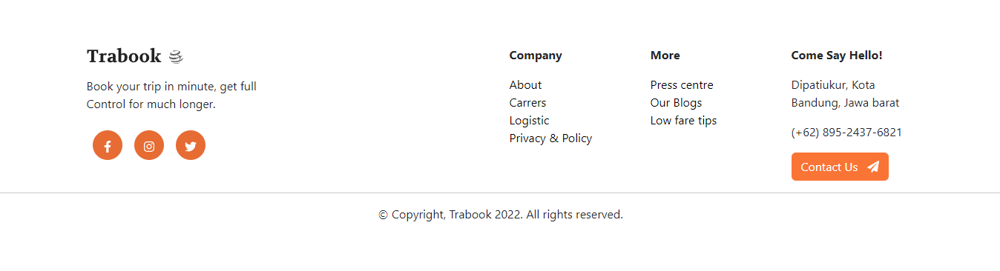

# Weekly Task 1

## Objective

Pembuatan sebuah halaman menggunakan HTML, CSS/Framework, dan JS. Halaman ini berada pada satu index.html sehingga tidak perlu melakukan routing. Beberapa hal yang perlu untuk dibuat ada dibagian kriteria.

## Criteria

1.  Kumpulkan pada repo yang kalian buat untuk mengumpulkan tugas. Berilah nama foldernya weekly1.

    - Buat folder project yang berisikan kode yang kalian buat.
    - Buat folder screenshot dan masukkan hasil dari kode yang kalian buat.

    

2.  Buatlah sebuah footer untuk halaman website kalian. Footer tersebut memiliki beberapa komponen yaitu.

    - Terdapat link sosial media kalian (minimal 3)
    - Terdapat nama dari website
    - Terdapat nomor telepon dan juga alamat

    Bagian lain dapat dibuatsusai keinginan kalian, tapi tiga komponen diatas merupakan standar minimal. Design pada gambar di bawah hanya contoh. Kalian bebas menggunakan design yang kalian inginkan.

    

## Project 2

1. Buatlah welcome page dan lakukan pemasangan bootstrap pada halaman kalian. Dan buatlah beberapa hal

   - Header (memeiliki logo dan juga navigation bar)
   - Welcome section (terdapat gambar dan kata kata yang menarik user)

   Gamabr di bawah hanya contoh untuk kalian, kalian bebas menerapkan design yang kalian inginkan. Kalian juga boleh menggunakan component bootstrap.

   

2. Buatlah contact us (dengan framework bootstrap) dengan kriteria dari aplikasi adalah sebagai berikut:

   - Memiliki 4 buah form (username bertipe text, email bertipe email, message bertipe text area).
   - memiliki button submit (jika kita menekan tombol submit maka keluar alert yang berisikan data yang kita masukkan pada form)

   

---

## Code

Project menggunakan HTML, CSS, dan Javascript.

[index.html](./project/index.html)

## Tampilan

1. Header

   

2. Form

   

3. Alert Form

   

4. Footer

   

5. Fullscreen

   
