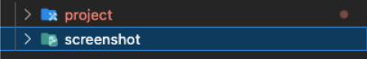
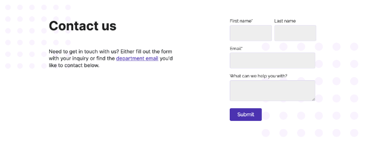
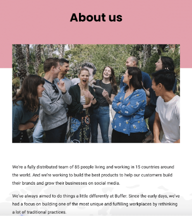
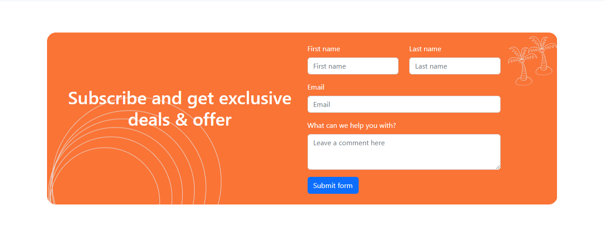
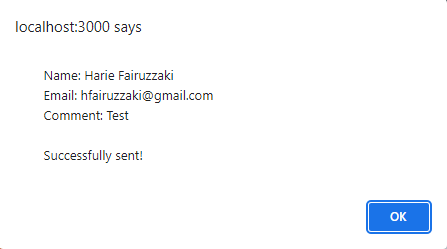
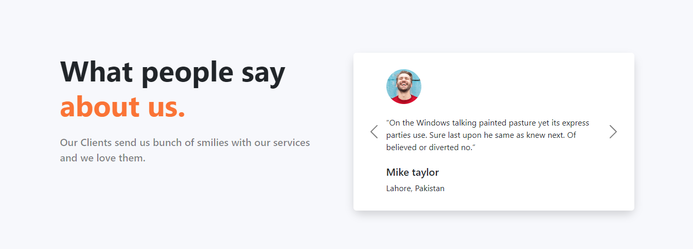

# Weekly Task 2

## Objective

Mengubah project yang telah kalian buat pada weekly task 1 ke dalam react. Website yang telah kalian buat menggunakan cara one page website. Sehingga tidak perlu menerapkan routing. Kalian juga diharuskan menerapkan teknologi dan library yang telah kalian pelajari.

## Criteria

1.  Buat folder weekly2 yang berisikan tugas dari weekly task 2.

    - Buat folder project yang berisikan kode yang kalian buat.
    - Buat folder screenshot dan masukkan hasil dari kode yang kalian buat.

    

2.  Ubahlah kode yang kalian tulis pada weekly task ke dalam react.
3.  Buatlah berfungsi component contact us kalian buat, sehingga ketika setiap form diisi dan button submit di klik akan memunculkan alert/modal yang berisikan data yang kalian masukkan ke dalam form.

    

4.  Buatlah sebuah halaman about us (dengan react) yang memiliki kriteria

    - Memiliki text about us
    - Memiliki gambar tentang about us
    - Memiliki text yang mendeskripsikan tentang about us

    

5.  Gabungkan welcome page, contact us, about us, dan footer yang telah kalian buat menjadi one page.

---

## Code

Mengubah weekly task 1 menjadi project React.

## Tampilan

1. Form

   

2. Alert Form

   

3. About Us

   

4. Fullscreen

   
